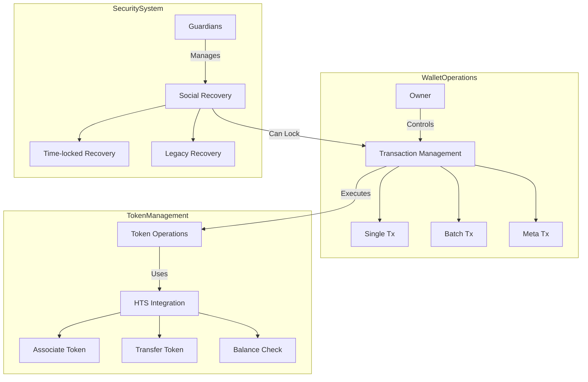

# TajiriWallet

## Overview

`TajiriWallet` is a smart contract wallet designed specifically for the Hedera network, providing account abstraction features for users of the Tajiri platform. It implements a multi-signature wallet with guardian support, integrated token management, and enhanced security features tailored to Hedera's architecture.

## Contract Details

- **License**: MIT
- **Solidity Version**: ^0.8.20
- **Hedera Compatibility**: Full native support for Hedera network

## Hedera Precompile Addresses

The contract uses the following Hedera precompiles:
- `HTS_PRECOMPILE`: Hedera Token Service (address 0x167)
- `EXCHANGE_RATE_PRECOMPILE`: Exchange Rate Service (address 0x168)

## State Variables

| Variable | Type | Description |
|----------|------|-------------|
| `owner` | address | Primary owner of the wallet |
| `guardian` | address | Guardian address for recovery operations |
| `isLocked` | bool | Lock status of the wallet |
| `isRecoveryInitiated` | bool | Whether recovery process has been initiated |
| `recoveryInitiatedTimestamp` | uint256 | Timestamp when recovery was initiated |
| `recoveryDelayPeriod` | uint256 | Required delay before recovery completion |
| `nonce` | uint256 | Transaction nonce for replay protection |
| `whitelist` | mapping(address => bool) | Addresses whitelisted for automatic transactions |

## Events

| Event | Parameters | Description |
|-------|------------|-------------|
| `WalletCreated` | owner, guardian | Emitted when wallet is created |
| `RecoveryInitiated` | initiator, newOwner, timestamp | Emitted when recovery is initiated |
| `RecoveryCompleted` | newOwner | Emitted when recovery is completed |
| `TransactionExecuted` | target, value, data, success | Emitted on transaction execution |
| `WalletLocked` | locker | Emitted when wallet is locked |
| `WalletUnlocked` | unlocker | Emitted when wallet is unlocked |
| `GuardianUpdated` | oldGuardian, newGuardian | Emitted when guardian is updated |
| `TokenAssociated` | tokenId | Emitted when a token is associated with the wallet |
| `TokenDissociated` | tokenId | Emitted when a token is dissociated from the wallet |

## Architecture



## System Integration

### Platform Role
TajiriWallet serves as the user's primary interface with the Tajiri ecosystem:
- Acts as a secure digital vault for both HBAR and tokenized stocks
- Handles all blockchain interactions transparently
- Integrates directly with the stock trading contracts
- Manages token associations and transfers automatically

### Trading Flow
1. User initiates trade through frontend
2. Wallet validates and processes transaction:
   - Checks token associations
   - Verifies balances
   - Handles token transfers
3. Interacts with Hedera services:
   - Token Service for transfers
   - Exchange Rate Service for pricing
   - Transaction processing

## Advanced Features

### Transaction Management
- **Single Transactions**: Standard operations for daily use
- **Batch Processing**: 
  - Combines multiple operations into one transaction
  - Reduces overall gas costs
  - Improves user experience for complex operations
- **Meta Transactions**: 
  - Enables gasless transactions
  - Users sign messages off-chain
  - Platform can sponsor transaction fees

### Security Architecture
The wallet implements a dual-security model:
1. **Primary Access**: Owner controls daily operations
2. **Emergency System**: Guardian-based recovery mechanism
   - Multiple guardian approval requirement
   - 2-day timelock for safety
   - Prevents unauthorized instant access

### Token Operations
Specialized handling for Hedera Token Service (HTS):
- Automatic token association management
- Direct integration with exchange rate services
- Streamlined token transfers and approvals
- Real-time balance monitoring

## Modifiers

| Modifier | Description |
|----------|-------------|
| `onlyOwner` | Restricts function access to wallet owner |
| `onlyGuardian` | Restricts function access to wallet guardian |
| `onlyOwnerOrGuardian` | Restricts function access to owner or guardian |
| `notLocked` | Ensures wallet is not in locked state |
| `requiresRecovery` | Ensures recovery process has been initiated |

## Functions

### Constructor

```solidity
constructor(address _owner, address _guardian)
```

Initializes the wallet with an owner and guardian.

- **Parameters**:
  - `_owner`: Primary owner address
  - `_guardian`: Guardian address for recovery

### Core Functionality

#### executeTransaction

```solidity
function executeTransaction(
    address target,
    uint256 value,
    bytes calldata data
) external onlyOwner notLocked returns (bool, bytes memory)
```

Executes a transaction from the wallet.

- **Parameters**:
  - `target`: Target contract address
  - `value`: HBAR value to send
  - `data`: Call data for the transaction
- **Returns**: Success status and response data
- **Modifiers**: onlyOwner, notLocked

#### validateSignature

```solidity
function validateSignature(
    bytes32 messageHash,
    bytes memory signature
) public view returns (bool)
```

Validates if a signature matches the owner's address.

- **Parameters**:
  - `messageHash`: Hash of the message
  - `signature`: Signature to validate
- **Returns**: Validation result (true/false)

### Token Management

#### associateToken

```solidity
function associateToken(address tokenAddress) external onlyOwner notLocked
```

Associates an HTS token with the wallet.

- **Parameters**:
  - `tokenAddress`: Address of the token to associate
- **Modifiers**: onlyOwner, notLocked

#### dissociateToken

```solidity
function dissociateToken(address tokenAddress) external onlyOwner notLocked
```

Dissociates an HTS token from the wallet.

- **Parameters**:
  - `tokenAddress`: Address of the token to dissociate
- **Modifiers**: onlyOwner, notLocked

#### transferHederaToken

```solidity
function transferHederaToken(
    address tokenAddress,
    address recipient,
    int64 amount
) external onlyOwner notLocked
```

Transfers HTS tokens to another address.

- **Parameters**:
  - `tokenAddress`: Token address
  - `recipient`: Recipient address
  - `amount`: Amount to transfer
- **Modifiers**: onlyOwner, notLocked

### Recovery System

#### initiateRecovery

```solidity
function initiateRecovery(address newOwner) external onlyGuardian
```

Initiates the recovery process to change ownership.

- **Parameters**:
  - `newOwner`: Address of the new owner
- **Modifiers**: onlyGuardian

#### completeRecovery

```solidity
function completeRecovery() external onlyGuardian requiresRecovery
```

Completes the recovery process after delay period.

- **Modifiers**: onlyGuardian, requiresRecovery

#### cancelRecovery

```solidity
function cancelRecovery() external onlyOwner
```

Cancels an ongoing recovery process.

- **Modifiers**: onlyOwner

### Wallet Security

#### lockWallet

```solidity
function lockWallet() external onlyOwnerOrGuardian
```

Locks the wallet, preventing transactions.

- **Modifiers**: onlyOwnerOrGuardian

#### unlockWallet

```solidity
function unlockWallet() external onlyGuardian
```

Unlocks a locked wallet.

- **Modifiers**: onlyGuardian

#### updateGuardian

```solidity
function updateGuardian(address newGuardian) external onlyOwner notLocked
```

Updates the wallet guardian.

- **Parameters**:
  - `newGuardian`: New guardian address
- **Modifiers**: onlyOwner, notLocked

#### addToWhitelist

```solidity
function addToWhitelist(address trusted) external onlyOwner notLocked
```

Adds an address to the transaction whitelist.

- **Parameters**:
  - `trusted`: Address to whitelist
- **Modifiers**: onlyOwner, notLocked

#### removeFromWhitelist

```solidity
function removeFromWhitelist(address untrusted) external onlyOwner notLocked
```

Removes an address from the transaction whitelist.

- **Parameters**:
  - `untrusted`: Address to remove
- **Modifiers**: onlyOwner, notLocked

## Usage Examples

### Creating a Wallet

```solidity
// Deploy a new wallet instance
TajiriWallet wallet = new TajiriWallet(ownerAddress, guardianAddress);
```

### Token Association

```solidity
// Associate an HTS token with the wallet
wallet.associateToken(htsTokenAddress);
```

### Executing Transactions

```solidity
// Execute a function call through the wallet
wallet.executeTransaction(
    targetContract,
    0, // No HBAR value 
    abi.encodeWithSignature("someFunction(uint256)", 123)
);
```

### Initiating Recovery

```solidity
// Guardian initiates recovery to a new owner
wallet.initiateRecovery(newOwnerAddress);

// After delay period
wallet.completeRecovery();
```

## Key Security Features

1. **Multi-layer Authorization**:
   - Owner for daily operations
   - Guardian for emergency access and recovery

2. **Social Recovery**:
   - Two-step recovery process with time delay
   - Prevention of immediate ownership changes

3. **Locking Mechanism**:
   - Guardian can lock wallet in case of compromise
   - Only guardian can unlock (prevents compromised owner access)

4. **Transaction Protection**:
   - Nonce system prevents replay attacks
   - Signature validation for secure authentication

## Hedera-Specific Features

1. **HTS Integration**:
   - Native association and management of Hedera tokens
   - Direct interaction with Hedera Token Service

2. **Optimized Gas Usage**:
   - Uses precompiles for efficient token operations
   - Batch processing capabilities

3. **HBAR Management**:
   - Direct HBAR transfers and receiving
   - Integration with Hedera Exchange Rate Service

## Attack Vectors and Mitigations

| Attack Vector | Mitigation |
|---------------|------------|
| Owner key compromise | Guardian can lock wallet and initiate recovery |
| Guardian key compromise | Cannot execute transactions, only recovery |
| Phishing attacks | Whitelist for trusted contracts |
| Replay attacks | Nonce system for transaction uniqueness |
| Flash loan attacks | Time-delay for recovery operations |
