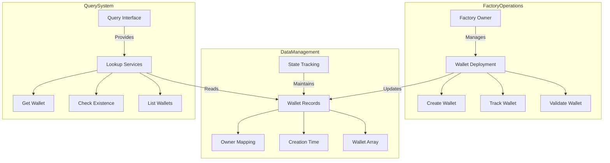

# TajiriWalletFactory

## Overview

`TajiriWalletFactory` is a factory contract for deploying new `TajiriWallet` instances on the Hedera network. It provides a centralized way to create, track, and manage multiple smart contract wallets, facilitating easy onboarding of users to the Tajiri platform with enhanced security features.

## Contract Details

- **License**: MIT
- **Solidity Version**: ^0.8.20
- **Hedera Compatibility**: Full native support for Hedera network

## State Variables

| Variable | Type | Description |
|----------|------|-------------|
| `wallets` | mapping(address => address[]) | Maps user addresses to their created wallets |
| `walletToOwner` | mapping(address => address) | Maps wallet addresses to their owners |
| `walletTimestamps` | mapping(address => uint256) | Creation timestamps for each wallet |
| `totalWallets` | uint256 | Total number of wallets created |

## Architecture



## System Integration

### Factory Role
TajiriWalletFactory serves as the central hub for wallet management in the Tajiri ecosystem:
- Acts as the single source of truth for wallet deployment
- Maintains comprehensive records of all platform wallets
- Provides verification and lookup services
- Ensures consistent wallet creation and tracking

### Deployment Flow
1. User requests wallet creation through platform
2. Factory validates eligibility:
   - Checks if user already has a wallet
   - Verifies input parameters
3. Creates new wallet instance:
   - Deploys TajiriWallet contract
   - Records ownership and metadata
   - Emits creation event

## Advanced Features

### Wallet Management
- **Deployment Control**: 
  - Centralized wallet creation
  - Standardized initialization
  - Automated tracking
- **Record Keeping**:
  - Complete wallet registry
  - Creation timestamps
  - Ownership verification

### Query System
The factory implements an efficient query system:
1. **Direct Lookups**: 
   - Quick owner-to-wallet mapping
   - Instant existence verification
2. **Paginated Listings**:
   - Scalable wallet enumeration
   - Efficient data retrieval
   - Handles large datasets

### Security Architecture
The factory maintains several security measures:
1. **Ownership Control**:
   - Administrative functions restricted to owner
   - Controlled factory management
2. **Data Integrity**:
   - Immutable wallet records
   - Consistent state management
   - Event logging for transparency

## Events

| Event | Parameters | Description |
|-------|------------|-------------|
| `WalletCreated` | owner, guardian, walletAddress, timestamp | Emitted when a new wallet is created |

## Functions

### Constructor

```solidity
constructor()
```

Initializes the factory contract.

### Wallet Creation

#### createWallet

```solidity
function createWallet(address guardian) external returns (address)
```

Creates a new TajiriWallet with the sender as owner and specified guardian.

- **Parameters**:
  - `guardian`: Address of the wallet guardian
- **Returns**: Address of the newly created wallet
- **Process**:
  1. Deploys a new TajiriWallet instance
  2. Records the wallet in the tracking mappings
  3. Increments the total wallet counter
  4. Emits a WalletCreated event

### Wallet Lookup

#### getWalletsByOwner

```solidity
function getWalletsByOwner(address owner) external view returns (address[] memory)
```

Retrieves all wallets created by a specific owner.

- **Parameters**:
  - `owner`: Address of the wallet owner
- **Returns**: Array of wallet addresses

#### getWalletOwner

```solidity
function getWalletOwner(address walletAddress) external view returns (address)
```

Retrieves the owner of a specific wallet.

- **Parameters**:
  - `walletAddress`: Address of the wallet
- **Returns**: Owner address

#### getWalletCreationTime

```solidity
function getWalletCreationTime(address walletAddress) external view returns (uint256)
```

Retrieves the creation timestamp of a specific wallet.

- **Parameters**:
  - `walletAddress`: Address of the wallet
- **Returns**: Creation timestamp

#### getTotalWallets

```solidity
function getTotalWallets() external view returns (uint256)
```

Returns the total number of wallets created through this factory.

- **Returns**: Total wallet count

## Usage Examples

### Creating a New Wallet

```solidity
// Deploy the factory
TajiriWalletFactory factory = new TajiriWalletFactory();

// Create a new wallet with a guardian
address myWallet = factory.createWallet(guardianAddress);
```

### Retrieving User Wallets

```solidity
// Get all wallets owned by an address
address[] memory userWallets = factory.getWalletsByOwner(userAddress);
```

### Statistics and Verification

```solidity
// Get total number of wallets created
uint256 totalWallets = factory.getTotalWallets();

// Verify wallet ownership
address walletOwner = factory.getWalletOwner(walletAddress);

// Check when a wallet was created
uint256 creationTime = factory.getWalletCreationTime(walletAddress);
```

## Technical Implementation

### Wallet Deployment
The factory deploys wallets using a standardized process:

```solidity
TajiriWallet wallet = new TajiriWallet(owner);
address walletAddress = address(wallet);
```

### Data Management
The factory maintains four key data structures:

1. **Owner-to-Wallet Mapping**:
   - Maps user addresses to their wallets
   - Ensures one wallet per owner
   - Quick lookup capability

2. **Wallet Validation**:
   - Tracks valid wallet addresses
   - Prevents unauthorized registrations
   - Enables quick verification

3. **Creation Records**:
   - Stores deployment timestamps
   - Enables chronological tracking
   - Supports audit functionality

4. **Global Registry**:
   - Maintains complete wallet list
   - Supports paginated queries
   - Enables platform analytics

## Integration with Tajiri Platform

### User Onboarding Flow

1. **Wallet Creation**: New user creates a wallet through the factory
2. **Guardian Setup**: User specifies a trusted guardian address
3. **Wallet Funding**: Initial HBAR is transferred to the new wallet
4. **Token Association**: User associates tokens using wallet functions
5. **Platform Integration**: Wallet interacts with Tajiri stock contracts

### Multi-Wallet Support

The factory supports creating multiple wallets per user, enabling:
- Separate wallets for different purposes (trading, savings, etc.)
- Different security configurations (guardian choices)
- Portfolio segregation

## Security Considerations

1. **No Admin Control**: Factory doesn't retain control over created wallets
2. **Immutable Relationships**: Wallet-owner relationships cannot be changed
3. **Transparent Tracking**: All creation events are logged on-chain
4. **No Backdoors**: Factory cannot access funds in created wallets

## Frontend Integration

The factory contract provides essential endpoints for frontend wallet management:

1. **Wallet Creation**: Direct interface for new wallet deployment
2. **Wallet Listing**: Retrieval of all user wallets
3. **Verification**: Confirmation of wallet ownership and creation time
4. **Analytics**: Total wallet count for platform metrics

## Deployment Recommendations

When deploying the TajiriWalletFactory:

1. Verify the correct TajiriWallet implementation is used
2. Ensure sufficient gas for deployment (factory deployment + sample wallet)
3. Consider adding the factory address to platform documentation
4. Log the factory address for user reference
