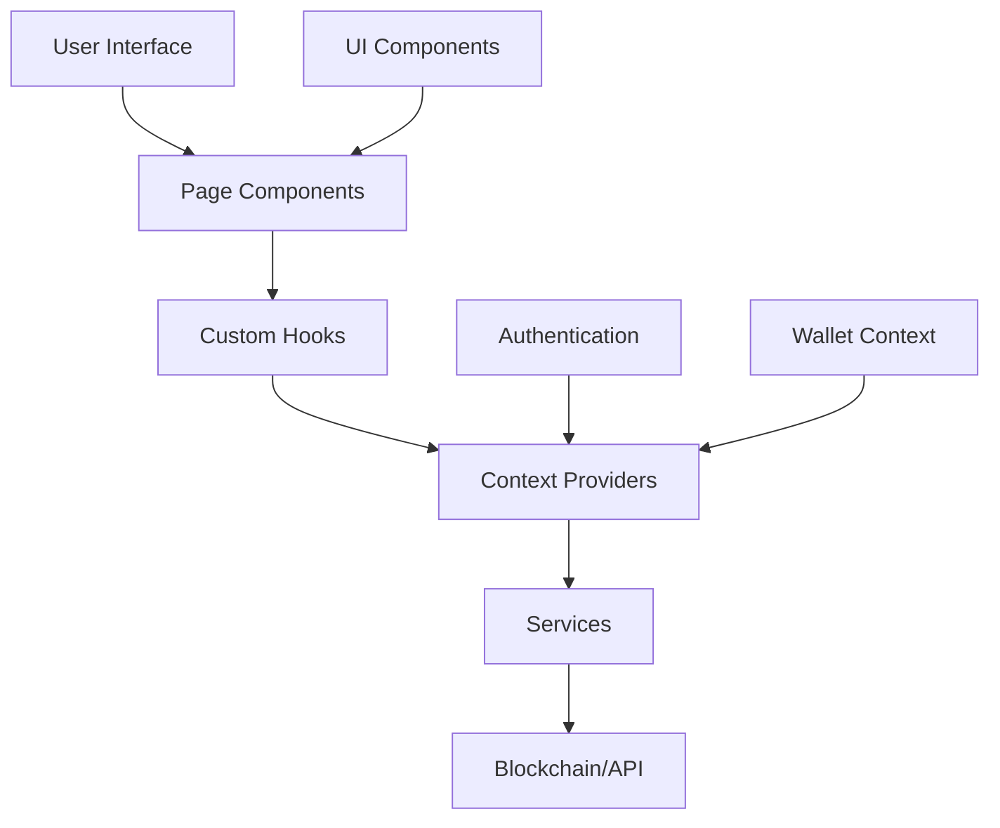

# Frontend Architecture Overview

## Introduction

The Tajiri frontend is built as a modern, responsive web application using Next.js and React. It provides a user-friendly interface for interacting with the Tajiri platform's blockchain functionality, including wallet management, stock trading, and P2P transactions.

## Technology Stack

- **Framework**: Next.js 14 (App Router)
- **UI Library**: React 18
- **State Management**: React Context API
- **Styling**: Tailwind CSS
- **Authentication**: NextAuth.js with Google provider
- **Blockchain Interaction**: Hedera JavaScript SDK

## Core Architecture



## Directory Structure

The frontend codebase follows a modular structure:

```
frontend/
├── public/           # Static assets
├── src/              # Source code
│   ├── app/          # Next.js pages (App Router)
│   ├── components/   # React components
│   ├── contexts/     # Context providers
│   ├── hooks/        # Custom React hooks
│   ├── providers/    # Provider components
│   ├── services/     # Service modules for blockchain/API
│   ├── styles/       # Global styles
│   ├── types/        # TypeScript type definitions
│   └── utils/        # Utility functions
├── docs/             # Documentation
└── scripts/          # Deployment and utility scripts
```

## Core Subsystems

### 1. Authentication System

The platform uses NextAuth.js with Google OAuth for secure user authentication. This system:
- Handles user login flows
- Manages session state
- Integrates with wallet creation

### 2. Wallet System

The wallet system handles all interaction with blockchain wallets:
- Smart wallet creation and management
- Transaction execution
- Token management
- Balance monitoring

### 3. Stock Trading System

The stock trading interface allows users to:
- Browse available stocks
- View real-time pricing
- Execute trades
- Monitor portfolio performance

### 4. P2P Trading System

The peer-to-peer trading system enables direct trading between users:
- Create buy and sell offers
- Browse open market offers
- Execute trades with other users
- Track trade history

## Key Design Patterns

### Context-Based State Management

The application uses React Context API for state management, with dedicated contexts for:
- Wallet state (`WalletContext`)
- Authentication state (`AuthContext`)
- UI state (`UIContext`)

### Service Layer Architecture

Services act as an abstraction layer between UI components and external systems:
- `walletService`: Handles wallet interactions
- `hederaService`: Manages Hedera blockchain communication
- `stockService`: Handles stock data and trades
- `p2pService`: Manages peer-to-peer trading

### Component Composition

UI components follow a composition pattern:
- Base components for common UI elements
- Composite components that combine base components
- Page components that assemble the complete view

## Development Workflow

1. **Setup**: Clone repository and install dependencies
2. **Development**: Run local development server with hot reloading
3. **Testing**: Test components and services
4. **Building**: Create optimized production build
5. **Deployment**: Deploy to hosting environment

## Integration Points

### Smart Contract Integration

The frontend integrates with Tajiri smart contracts through:
- `hederaService`: For blockchain communication
- `walletService`: For wallet operations
- Service-specific modules for token and trading operations

### Authentication Integration

User authentication flows integrate with:
- Google OAuth for secure sign-in
- NextAuth.js for session management
- Automatic wallet creation upon authentication

## Performance Considerations

The application is optimized for performance through:
- Component lazy loading
- Static generation where possible
- Incremental static regeneration for dynamic data
- Optimistic UI updates for better user experience
- Caching strategies for blockchain data 