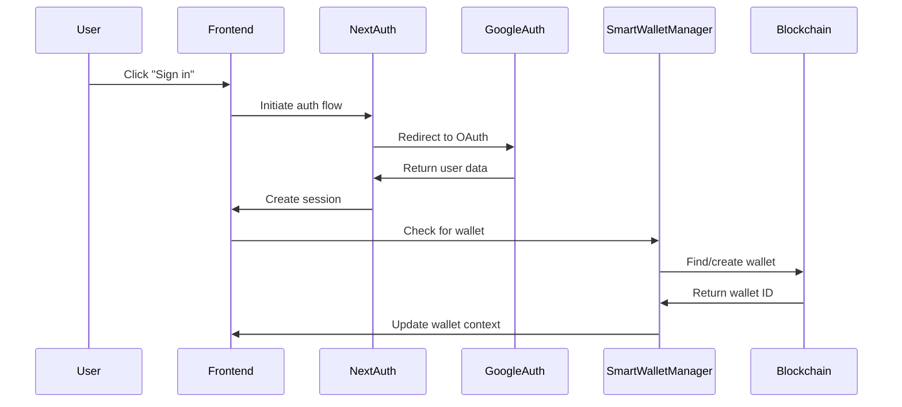

# Authentication System

## Overview

The Tajiri platform implements a modern authentication system that combines social login (Google OAuth) with automatic smart wallet creation. This approach simplifies the onboarding process and removes friction for users new to blockchain applications.

## Architecture



## Key Components

### 1. AuthProvider

Located at `frontend/src/providers/AuthProvider.tsx`, this component:
- Wraps the application with NextAuth's `SessionProvider`
- Includes the `SmartWalletManager` for automatic wallet setup
- Makes authentication state available throughout the application

```typescript
// Provider implementation
export default function AuthProvider({
  children,
}: {
  children: React.ReactNode;
}) {
  return (
    <SessionProvider>
      <SmartWalletManager />
      {children}
    </SessionProvider>
  );
}
```

### 2. SmartWalletManager

Located at `frontend/src/components/SmartWalletManager.tsx`, this component:
- Automatically creates a smart wallet for authenticated users
- Checks for existing wallets before creating new ones
- Implements retry logic for network issues
- Stores wallet IDs in local storage for persistence

### 3. NextAuth Configuration

Located at `frontend/src/app/api/auth/[...nextauth]/route.ts`, this file:
- Configures NextAuth.js with Google OAuth provider
- Sets up session handling and callbacks
- Manages token and session security
- Creates custom user IDs compatible with Hedera addressing

## Authentication Flow

### Sign In Process

1. **User Initiates Sign In**
   - User clicks "Sign In with Google" button
   - Frontend calls `signIn('google')` from NextAuth.js

2. **OAuth Authentication**
   - User is redirected to Google for authentication
   - Google verifies identity and returns to callback URL

3. **Session Creation**
   - NextAuth creates a secure session
   - User profile information is processed
   - Session token is stored in cookies

4. **Wallet Association**
   - `SmartWalletManager` automatically activates
   - Checks if user already has a smart wallet
   - Creates new wallet if needed
   - Stores wallet ID in local storage

### Sign Out Process

1. **User Initiates Sign Out**
   - User clicks sign out button
   - Frontend calls `signOut()` from NextAuth.js

2. **Session Termination**
   - NextAuth clears session data
   - Cookies are invalidated
   - User is returned to unauthenticated state

3. **Wallet Context Update**
   - `WalletContext` is updated to reflect disconnected state
   - Smart wallet ID is retained in localStorage for future sessions

## Implementation Details

### Required Environment Variables

```
GOOGLE_CLIENT_ID=your-google-client-id
GOOGLE_CLIENT_SECRET=your-google-client-secret
NEXTAUTH_SECRET=random-secret-for-encryption
NEXTAUTH_URL=your-app-url
```

### Google OAuth Configuration

1. Create a project in Google Cloud Console
2. Configure OAuth consent screen
3. Create OAuth credentials (Web application)
4. Add authorized redirect URIs:
   - `http://localhost:3000/api/auth/callback/google` (development)
   - `https://your-domain.com/api/auth/callback/google` (production)

### Session Configuration

```typescript
// NextAuth configuration
export const authOptions: NextAuthOptions = {
  providers: [
    GoogleProvider({
      clientId: process.env.GOOGLE_CLIENT_ID!,
      clientSecret: process.env.GOOGLE_CLIENT_SECRET!,
    }),
  ],
  session: {
    strategy: 'jwt',
    maxAge: 30 * 24 * 60 * 60, // 30 days
  },
  callbacks: {
    session: ({ session, token }) => {
      // Custom session handling
    },
    jwt: ({ token, user }) => {
      // Custom JWT handling
    }
  }
};
```

## Smart Wallet Integration

### Wallet Creation Process

1. **Check Existing Wallet**
   - Look for wallet ID in localStorage
   - Verify wallet exists on blockchain
   - Confirm wallet ownership

2. **Create New Wallet**
   - Use `walletService.createSmartWallet()` with user ID
   - Wait for transaction confirmation
   - Store new wallet ID in localStorage

3. **Connection State Management**
   - Update `WalletContext` with connection status
   - Make wallet functions available throughout app
   - Enable blockchain interactions

### Error Handling and Retries

The system implements robust error handling:
- Exponential backoff for transaction retries
- User-friendly error messages
- Automatic retry of failed wallet creation
- Debug information for troubleshooting

## Security Considerations

### Session Security

- JWTs are encrypted using NEXTAUTH_SECRET
- CSRF protection is enabled
- Session cookies are HTTP-only and secure
- Session timeout set to 30 days by default

### Wallet Security

- Smart wallet security is enforced at contract level
- User ID is used for identifying wallet ownership
- Private keys remain secure through contract-level permissions
- Social recovery is available for wallet access recovery

## Usage Examples

### Checking Authentication Status

```tsx
'use client';

import { useSession } from 'next-auth/react';

export default function ProfilePage() {
  const { data: session, status } = useSession();
  
  if (status === 'loading') {
    return <div>Loading...</div>;
  }
  
  if (status === 'unauthenticated') {
    return <div>Please sign in to view your profile</div>;
  }
  
  return (
    <div>
      <h1>Welcome, {session?.user?.name}</h1>
      {/* Profile content */}
    </div>
  );
}
```

### Triggering Sign In

```tsx
'use client';

import { signIn } from 'next-auth/react';

export default function SignInButton() {
  return (
    <button
      onClick={() => signIn('google')}
      className="bg-decode-green hover:bg-decode-green/80 text-white px-4 py-2 rounded-lg"
    >
      Sign in with Google
    </button>
  );
}
```

## Troubleshooting

### Common Issues

1. **Wallet Creation Delays**
   - Check Hedera network status
   - Verify environment variables
   - Review browser console for errors
   - Use the debug page (/debug) for detailed diagnostics

2. **Authentication Failures**
   - Verify Google OAuth credentials
   - Check redirect URI configuration
   - Ensure NEXTAUTH_URL is correctly set
   - Verify NEXTAUTH_SECRET is properly configured

3. **Session Persistence Issues**
   - Check cookie settings in browser
   - Verify localStorage access
   - Confirm session configuration
   - Test in private browsing mode 