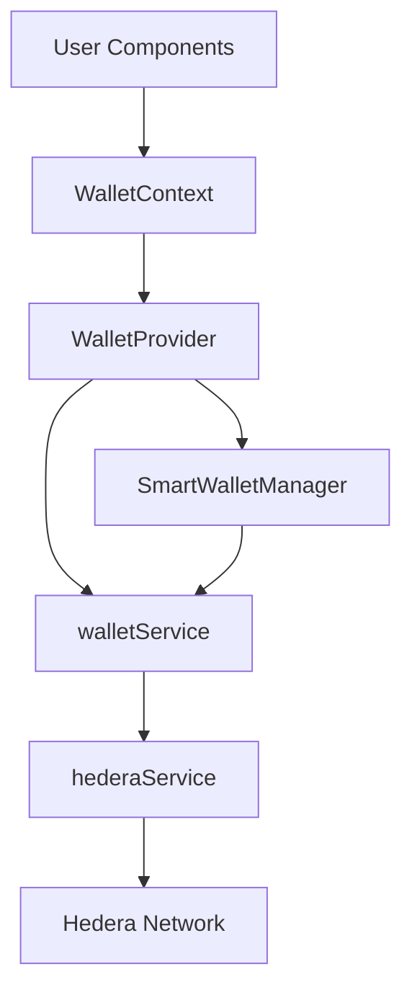

# Wallet System

## Overview

The Tajiri wallet system provides a seamless interface between the frontend application and the Hedera blockchain. It leverages smart contract wallets (implemented in the `TajiriWallet` contract) to provide enhanced security, account abstraction, and a user-friendly experience.

## Architecture



## Key Components

### 1. WalletContext

Located at `frontend/src/contexts/WalletContext.tsx`, this context provides:
- Wallet state management
- Connection status tracking
- Transaction execution methods
- Token management
- Error handling

### 2. WalletProvider

The `WalletProvider` component wraps the application and makes wallet functionality available throughout the component tree. Key features:
- Initializes connection to Hedera network
- Maintains wallet state
- Provides transaction functions
- Handles error states

### 3. SmartWalletManager

Located at `frontend/src/components/SmartWalletManager.tsx`, this component:
- Automatically creates and manages smart wallets
- Integrates with the authentication system
- Implements retry logic for network issues
- Provides status updates during wallet operations

### 4. walletService

Located at `frontend/src/services/walletService.ts`, this service:
- Communicates with the `TajiriWallet` and `TajiriWalletFactory` contracts
- Provides methods for wallet creation and interaction
- Handles token operations
- Manages transaction execution

### 5. hederaService

Located at `frontend/src/services/hederaService.ts`, this service:
- Manages low-level interaction with the Hedera network
- Handles client initialization and connection
- Provides methods for contract calls and queries
- Implements retry logic for network issues

## Wallet Lifecycle

### Creation Process

1. **Authentication**
   - User signs in with Google
   - `SmartWalletManager` is triggered

2. **Wallet Check**
   - Check for existing wallet in localStorage
   - Query blockchain to verify existence

3. **Smart Wallet Creation**
   - If no wallet exists, create a new smart wallet
   - Uses `TajiriWalletFactory` contract
   - Stores wallet ID in localStorage

4. **Initialization**
   - Update `WalletContext` with new wallet ID
   - Fetch wallet balance
   - Update connection status

### Transaction Flow

1. **Transaction Request**
   - Component calls `executeTransaction` from `WalletContext`
   - Parameters include target contract, function, and parameters

2. **Transaction Processing**
   - `walletService` formats the transaction
   - Sends to `TajiriWallet` contract via `hederaService`
   - Handles gas estimation and fee calculation

3. **Result Handling**
   - Wait for transaction confirmation
   - Update wallet state (balance, etc.)
   - Return result to calling component

## Implementation Details

### State Management

The `WalletContext` maintains the following state:
- `client`: Hedera client instance
- `accountId`: User's account ID
- `isConnected`: Connection status
- `smartWalletId`: ID of the user's smart wallet
- `balance`: Current wallet balance
- `isLoading`: Loading state for transactions
- `error`: Error messages from operations

### Key Methods

#### Creating a Smart Wallet

```typescript
export async function createSmartWallet(accountId: string): Promise<string> {
  try {
    // First check if wallet already exists
    const existingWallet = await findSmartWalletForOwner(accountId);

    if (existingWallet) {
      console.log("Smart wallet already exists for owner:", existingWallet);
      return existingWallet;
    }

    // Create parameters for wallet creation
    const params = new ContractFunctionParameters()
      .addAddress(accountId); // Owner address

    // Call the factory to create a new wallet
    const receipt = await hederaService.executeContract(
      SMART_WALLET_FACTORY,
      "createWallet",
      params
    );

    // Parse the creation event to get the new wallet address
    const newWalletAddress = receipt.contractFunctionResult?.getAddress(0) || '';
    
    // Fund the wallet with a small amount of HBAR to cover initial fees
    await fundNewWallet(newWalletAddress);

    return newWalletAddress;
  } catch (err) {
    // Error handling logic
  }
}
```

#### Executing a Transaction

```typescript
const executeTransaction = async (
  targetContract: string, 
  functionName: string, 
  params: any[], 
  value: number = 0
) => {
  if (!client || !smartWalletId) {
    throw new Error('No wallet connected or smart wallet not created');
  }
  
  setIsLoading(true);
  setError(null);
  setIsError(false);
  
  try {
    const receipt = await walletService.executeTransaction(
      smartWalletId,
      targetContract,
      functionName,
      params,
      value
    );
    
    // Update balance after transaction
    await fetchBalance();
    
    return receipt;
  } catch (err: any) {
    setError(`Transaction failed: ${err.message}`);
    setIsError(true);
    throw err;
  } finally {
    setIsLoading(false);
  }
};
```

## Error Handling and Recovery

The wallet system implements robust error handling:

### Retry Mechanisms

- Exponential backoff for network issues
- Multiple attempts for transaction submission
- Automatic retry on specific error conditions

### Error Reporting

- User-friendly error messages
- Detailed console logging
- Error state tracking in context

### Wallet Debugging

The application includes a wallet debugger (`/debug`) that helps diagnose issues by:
- Testing network connectivity
- Verifying contract availability
- Checking wallet status
- Providing manual retry options

## Token Management

The wallet system provides comprehensive token management:

### Token Association

Smart wallet contracts require explicit association with tokens:

```typescript
async function associateToken(tokenId: string): Promise<boolean> {
  if (!client || !smartWalletId) {
    throw new Error('No wallet connected or smart wallet not created');
  }

  setIsLoading(true);
  setError(null);
  
  try {
    await walletService.associateToken(smartWalletId, tokenId);
    return true;
  } catch (err: any) {
    setError(`Failed to associate token: ${err.message}`);
    return false;
  } finally {
    setIsLoading(false);
  }
}
```

### Token Transfers

```typescript
async function transferToken(
  tokenId: string, 
  recipientId: string, 
  amount: number
): Promise<boolean> {
  if (!client || !smartWalletId) {
    throw new Error('No wallet connected or smart wallet not created');
  }

  setIsLoading(true);
  setError(null);
  
  try {
    await walletService.transferToken(
      smartWalletId, 
      tokenId, 
      recipientId, 
      amount
    );
    return true;
  } catch (err: any) {
    setError(`Failed to transfer token: ${err.message}`);
    return false;
  } finally {
    setIsLoading(false);
  }
}
```

## Integration with UI Components

The wallet system integrates with UI components through:

### 1. useWallet Hook

```typescript
import { useWallet } from '@/contexts/WalletContext';

function MyComponent() {
  const { 
    isConnected, 
    balance, 
    executeTransaction, 
    isLoading, 
    error 
  } = useWallet();
  
  // Component logic
}
```

### 2. WalletConnection Component

Located at `frontend/src/components/WalletConnection.tsx`, this component:
- Displays wallet connection status
- Shows user balance
- Provides sign-in/sign-out functionality
- Handles error states

### 3. Transaction Components

Various components use the wallet system to execute blockchain transactions:
- `StockMintRedeem` for minting and redeeming stock tokens
- `P2PTradeForm` for peer-to-peer trading
- `Portfolio` for managing tokens

## Security Considerations

### Secure Storage

- Wallet IDs are stored in localStorage
- No private keys are stored in the browser
- Session management via NextAuth.js

### Transaction Security

- All transactions are executed through smart contract wallets
- Multiple security checks before execution
- Transaction nonces prevent replay attacks

### Error Prevention

- Input validation before transaction submission
- Balance checks before operations
- User confirmation for critical actions

## Configuration

### Environment Variables

```
NEXT_PUBLIC_MY_ACCOUNT_ID=your-hedera-account-id
NEXT_PUBLIC_MY_PRIVATE_KEY=your-private-key
NEXT_PUBLIC_SMART_WALLET_FACTORY_ADDRESS=factory-contract-address
```

### Hedera Client Configuration

```typescript
export function initializeClient(): Client {
  if (hederaClient) return hederaClient;

  const operatorId = getOperatorAccountId();
  const operatorKey = getOperatorPrivateKey();

  if (!operatorId || !operatorKey) {
    throw new Error('Environment variables for operator ID and private key must be set');
  }

  // Initialize a client with mainnet or testnet
  hederaClient = Client.forTestnet();

  // Set the operator account ID and private key
  hederaClient.setOperator(operatorId, PrivateKey.fromString(operatorKey));

  return hederaClient;
}
```

## Troubleshooting

### Common Issues

1. **Wallet Creation Delays**
   - Hedera network congestion
   - Insufficient gas fees
   - API connection issues
   - Contract call timeouts

2. **Transaction Failures**
   - Insufficient balance
   - Invalid parameters
   - Contract reverts
   - Network issues

3. **Token Association Problems**
   - Multiple association attempts
   - Insufficient gas for association
   - Token ID format issues

### Debugging Steps

1. Check browser console for detailed error messages
2. Visit the `/debug` page for diagnostics
3. Verify environment variables
4. Check Hedera account balance
5. Ensure proper network selection (testnet/mainnet) 