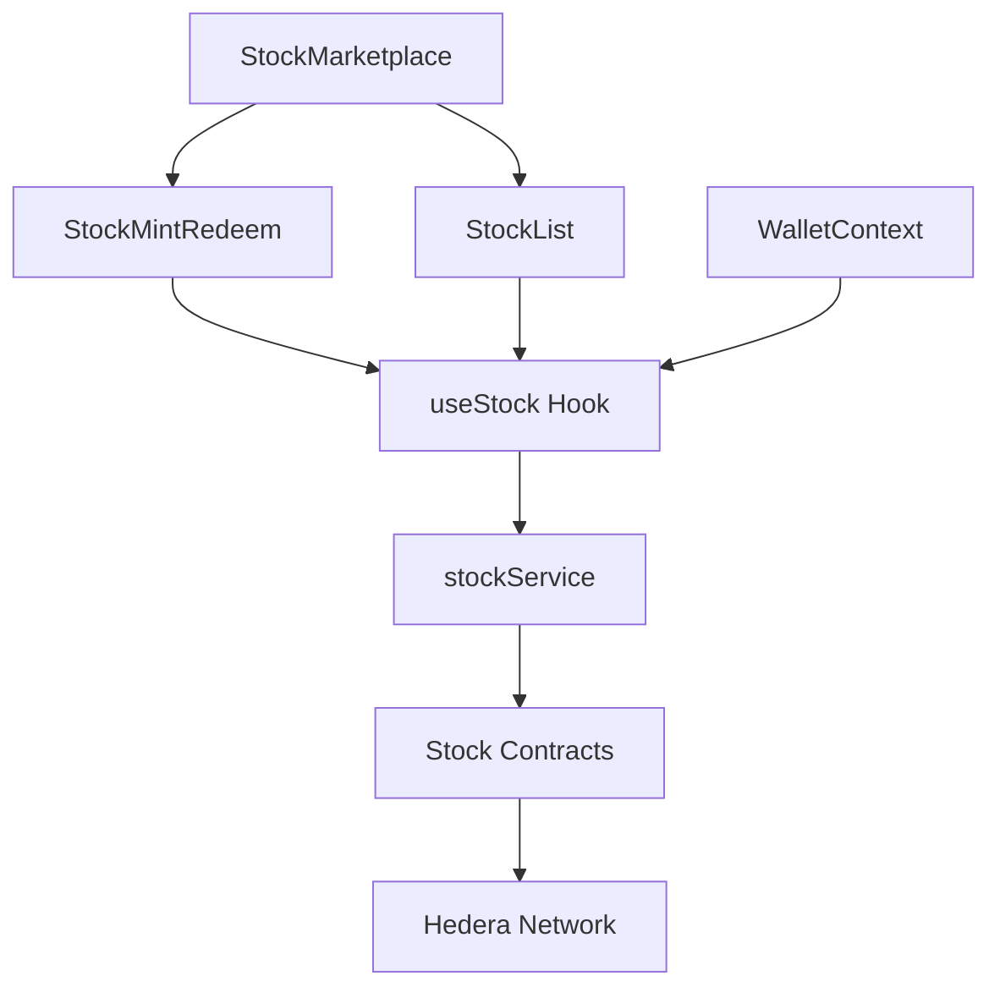
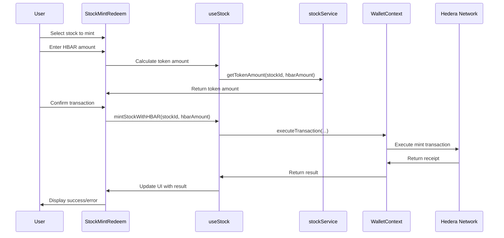
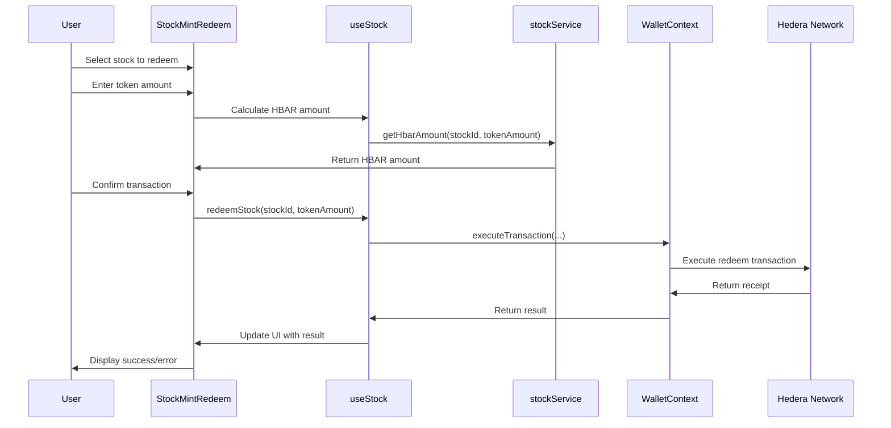

# Stock Trading System

## Overview

The Tajiri stock trading system provides a comprehensive interface for users to mint, redeem, and trade tokenized stocks on the Hedera network. The system integrates with the `ManageStock`, `MintStock`, and `RedeemStock` smart contracts to handle all stock-related operations.

## Architecture



## Key Components

### 1. StockMarketplace

Located at `frontend/src/components/StockMarketplace.tsx`, this component:
- Serves as the main entry point for stock trading
- Displays available stocks with pricing
- Provides search and filtering functionality
- Integrates the stock minting and redemption interface

### 2. StockMintRedeem

Located at `frontend/src/components/StockTokens/StockMintRedeem.tsx`, this component:
- Provides interfaces for minting stocks with HBAR or stablecoins
- Handles stock redemption back to HBAR
- Manages transaction status and feedback
- Calculates conversions and fees

### 3. useStock Hook

Located at `frontend/src/hooks/useStock.ts`, this custom hook:
- Provides access to stock-related functions
- Manages stock data and loading states
- Interfaces with the stock service layer
- Handles error conditions

### 4. stockService

Located at `frontend/src/services/stockService.ts`, this service:
- Communicates with the stock-related smart contracts
- Provides methods for minting, redeeming, and querying stocks
- Handles price calculations and conversions
- Manages stock list and details

## Stock Trading Flows

### Minting Process



### Redemption Process



## Implementation Details

### Stock Data Structure

```typescript
interface Stock {
  id: string;         // Contract address of the stock token
  symbol: string;     // Stock symbol (e.g., "SCOM")
  name: string;       // Full name (e.g., "Safaricom")
  decimals: number;   // Token decimals (typically 8)
  price: number;      // Current price in HBAR
  usdPrice: number;   // USD equivalent price
  imageUrl: string;   // Stock logo URL
  type: StockType;    // Enum: "LOCAL", "FOREIGN", etc.
  description?: string; // Optional description
}
```

### Key Methods

#### Fetching Available Stocks

```typescript
async function getAvailableStocks(): Promise<Stock[]> {
  try {
    // Get the number of available stocks from the contract
    const stockCountResult = await hederaService.queryContract(
      MANAGE_STOCK_CONTRACT_ID,
      "getStockCount"
    );
    
    const stockCount = stockCountResult.getUint256(0).toNumber();
    
    // Get all stocks
    const stocksPromises = Array(stockCount).fill(0).map(async (_, index) => {
      // Get stock address by index
      const stockAddressResult = await hederaService.queryContract(
        MANAGE_STOCK_CONTRACT_ID,
        "getStockByIndex",
        new ContractFunctionParameters().addUint256(index)
      );
      
      const stockAddress = stockAddressResult.getAddress(0);
      
      // Get stock details
      return getStockDetails(stockAddress);
    });
    
    return Promise.all(stocksPromises);
  } catch (error) {
    console.error("Error fetching available stocks:", error);
    throw error;
  }
}
```

#### Minting Stocks with HBAR

```typescript
async function mintStockWithHBAR(
  stockId: string, 
  hbarAmount: number
): Promise<boolean> {
  if (!wallet.isConnected || !wallet.smartWalletId) {
    throw new Error("Wallet not connected");
  }
  
  setLoading(true);
  
  try {
    // Execute the transaction through the wallet
    await wallet.executeTransaction(
      MINT_STOCK_CONTRACT_ID,
      "mintStockTokenWithHBAR",
      [stockId],
      hbarAmount
    );
    
    // Refresh balances
    await refreshBalances(stockId);
    
    return true;
  } catch (error) {
    console.error("Error minting stock:", error);
    setError(`Failed to mint stock: ${error.message}`);
    return false;
  } finally {
    setLoading(false);
  }
}
```

#### Redeeming Stocks

```typescript
async function redeemStock(
  stockId: string, 
  tokenAmount: number
): Promise<boolean> {
  if (!wallet.isConnected || !wallet.smartWalletId) {
    throw new Error("Wallet not connected");
  }
  
  setLoading(true);
  
  try {
    // Convert token amount to correct format based on decimals
    const adjustedAmount = tokenAmount * Math.pow(10, 8); // Assuming 8 decimals
    
    // Execute the transaction through the wallet
    await wallet.executeTransaction(
      REDEEM_STOCK_CONTRACT_ID,
      "redeemStockTokens",
      [stockId, adjustedAmount.toString()]
    );
    
    // Refresh balances
    await refreshBalances(stockId);
    
    return true;
  } catch (error) {
    console.error("Error redeeming stock:", error);
    setError(`Failed to redeem stock: ${error.message}`);
    return false;
  } finally {
    setLoading(false);
  }
}
```

## UI Components

### StockMarketplace Component

The StockMarketplace component provides a unified interface for:
- Browsing available stocks
- Filtering and searching stocks
- Accessing minting and redemption functionality

Key features:
- Responsive grid/table layout
- Search by name or symbol
- Sorting by price or alphabetically
- Detailed stock information
- Quick access to mint/redeem interface

### StockMintRedeem Component

This component provides a tabbed interface for:
- Minting stocks with HBAR
- Minting stocks with stablecoins
- Redeeming stocks back to HBAR

Key features:
- Stock selection dropdown
- Real-time price calculations
- Transaction summary display
- Comprehensive error handling
- Transaction status updates

## Integration with Wallet System

The stock trading system integrates deeply with the wallet system:

### Transaction Execution

All stock operations (minting, redemption) are executed through the wallet context:

```typescript
// Inside useStock hook
const mintStockWithHBAR = async (stockId: string, hbarAmount: number) => {
  if (!wallet.isConnected || !wallet.smartWalletId) {
    throw new Error("Wallet not connected");
  }
  
  return wallet.executeTransaction(
    MINT_STOCK_CONTRACT_ID,
    "mintStockTokenWithHBAR",
    [stockId],
    hbarAmount
  );
};
```

### Balance Tracking

The stock system tracks token balances through the wallet system:

```typescript
// Inside useStock hook
const getTokenBalance = async (tokenId: string): Promise<string> => {
  if (!wallet.isConnected || !wallet.smartWalletId) {
    return "0";
  }
  
  try {
    return await wallet.getTokenBalance(tokenId);
  } catch (error) {
    console.error("Error getting token balance:", error);
    return "0";
  }
};
```

## Price Calculation

The system includes sophisticated price calculation functions:

### Token Amount Calculation

```typescript
function calculateTokenAmount(hbarAmount: number, stockPrice: number): number {
  if (hbarAmount <= 0 || stockPrice <= 0) return 0;
  
  // Calculate how many tokens can be purchased with the given HBAR amount
  const tokenAmount = hbarAmount / stockPrice;
  
  // Round to 8 decimal places (typical token precision)
  return Math.floor(tokenAmount * 100000000) / 100000000;
}
```

### HBAR Amount Calculation

```typescript
function calculateHbarAmount(tokenAmount: number, stockPrice: number): number {
  if (tokenAmount <= 0 || stockPrice <= 0) return 0;
  
  // Calculate how much HBAR will be received for the given token amount
  const hbarAmount = tokenAmount * stockPrice;
  
  // Round to 8 decimal places
  return Math.floor(hbarAmount * 100000000) / 100000000;
}
```

## Error Handling

The stock trading system implements comprehensive error handling:

### User-Friendly Error Messages

```typescript
function getErrorMessage(error: any): string {
  if (error.message && error.message.includes("INSUFFICIENT_BALANCE")) {
    return "Insufficient balance to complete this transaction";
  }
  
  if (error.message && error.message.includes("CONTRACT_REVERT_EXECUTED")) {
    if (error.message.includes("Stock not registered")) {
      return "This stock is not registered in the system";
    }
    if (error.message.includes("Amount too small")) {
      return "The amount is too small for this transaction";
    }
  }
  
  return `Transaction failed: ${error.message || "Unknown error"}`;
}
```

### Transaction Validation

```typescript
function validateMintTransaction(
  stock: Stock | null, 
  hbarAmount: number,
  walletBalance: number
): string | null {
  if (!stock) {
    return "Please select a stock to mint";
  }
  
  if (hbarAmount <= 0) {
    return "Please enter a valid HBAR amount";
  }
  
  if (hbarAmount > walletBalance) {
    return "Insufficient balance in your wallet";
  }
  
  // All validations passed
  return null;
}
```

## Security Considerations

### Input Validation

- All user inputs are validated before transactions
- Amount validations ensure positive values
- Balance checks prevent insufficient funds errors

### Transaction Preview

- Users see a transaction summary before confirming
- Expected token amounts are calculated and displayed
- Potential fees are shown upfront

### Error Prevention

- Form validation prevents invalid submissions
- Disabled states prevent multiple submissions
- Clear error messages guide users

## Configuration

### Contract Addresses

The stock trading system is configured with the following contract addresses:

```
NEXT_PUBLIC_MANAGE_STOCK_CONTRACT_ID=0.0.XXXXX
NEXT_PUBLIC_MINT_STOCK_CONTRACT_ID=0.0.XXXXX
NEXT_PUBLIC_REDEEM_STOCK_CONTRACT_ID=0.0.XXXXX
```

### Token Configurations

Each stock token has specific configuration parameters:
- Decimals (typically 8)
- Symbol format (uppercase, 3-5 characters)
- Price precision (8 decimal places)

## Troubleshooting

### Common Issues

1. **Token Balance Not Showing**
   - Check token association status
   - Verify token ID format
   - Refresh balance with wallet reconnect

2. **Minting Failures**
   - Verify sufficient HBAR balance
   - Check contract addresses
   - Confirm token is registered in system

3. **Price Calculation Issues**
   - Verify decimal handling
   - Check for rounding errors
   - Confirm exchange rate source 