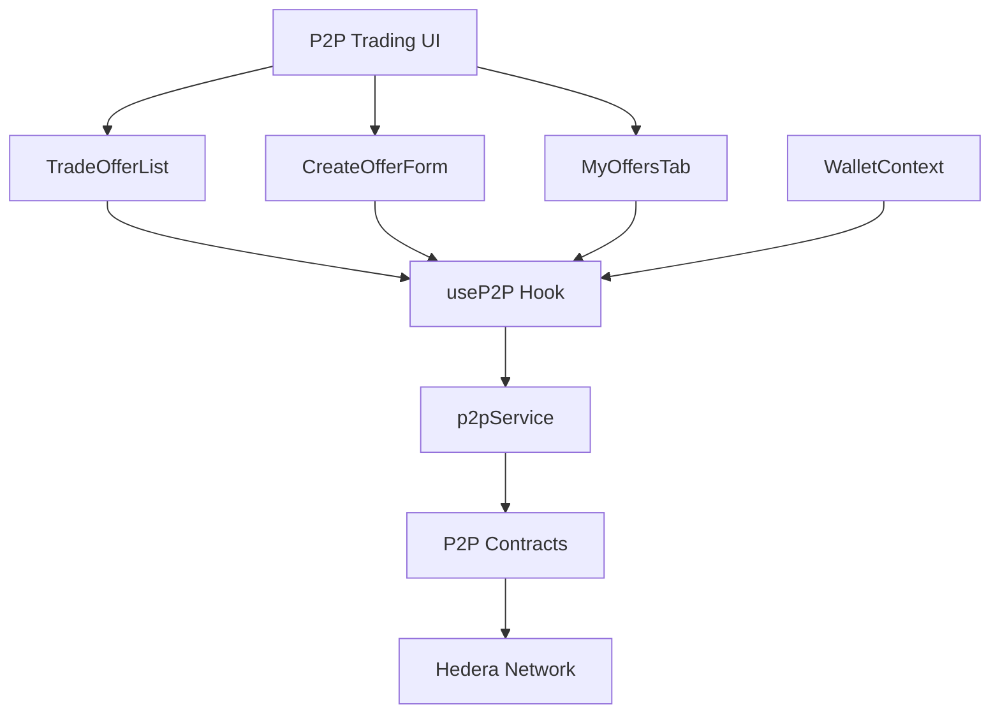
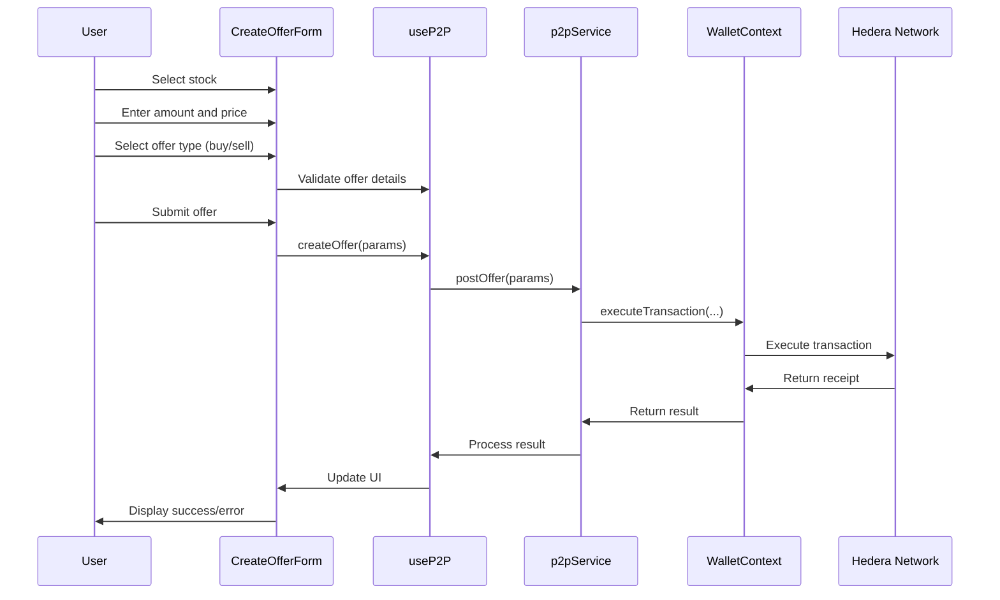
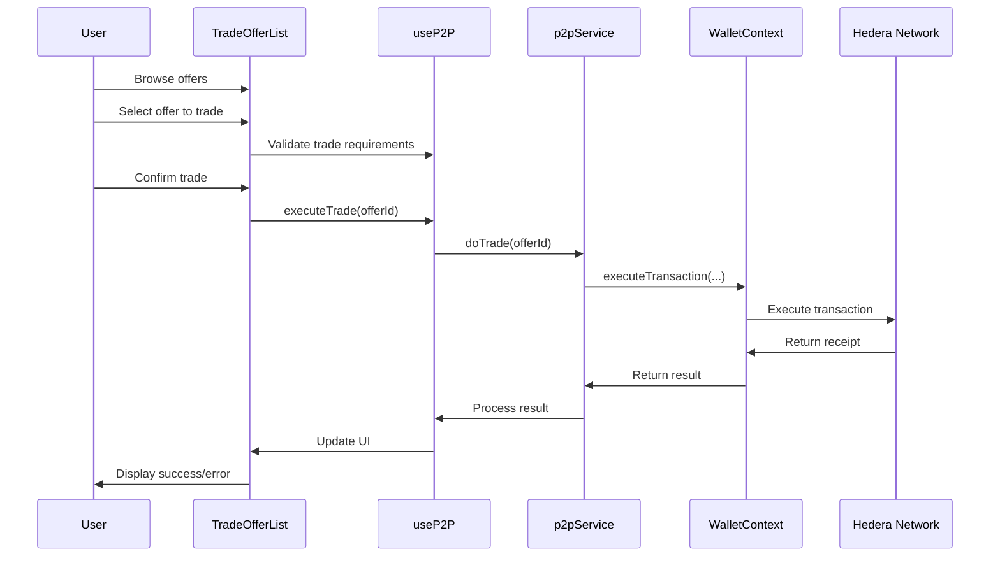

# P2P Trading System

## Overview

The Tajiri P2P trading system enables users to trade tokenized stocks directly with each other without intermediaries. It provides a decentralized marketplace where users can create buy/sell offers and execute trades at their agreed prices. The system integrates with the `PostOfferOnP2P` and `DoP2PTrade` smart contracts.

## Architecture



## Key Components

### 1. P2P Trading Interface

Located at `frontend/src/app/p2p/page.tsx`, this page component:
- Serves as the main entry point for P2P trading
- Provides tabbed navigation between different sections
- Integrates all P2P trading functionality

### 2. TradeOfferList Component

Located at `frontend/src/components/P2P/TradeOfferList.tsx`, this component:
- Displays available buy and sell offers
- Implements filtering and searching
- Provides trade execution interface
- Handles offer status updates

### 3. CreateOfferForm Component

Located at `frontend/src/components/P2P/CreateOfferForm.tsx`, this component:
- Allows users to create new buy or sell offers
- Handles form validation and submission
- Calculates estimated prices and fees
- Provides feedback on transaction status

### 4. MyOffersTab Component

Located at `frontend/src/components/P2P/MyOffersTab.tsx`, this component:
- Shows the user's active P2P offers
- Allows cancellation of existing offers
- Displays offer history and status
- Provides transaction management

### 5. useP2P Hook

Located at `frontend/src/hooks/useP2P.ts`, this custom hook:
- Provides P2P trading functionality to components
- Manages offers data and loading states
- Interfaces with the P2P service layer
- Handles error states and transaction processing

### 6. p2pService

Located at `frontend/src/services/p2pService.ts`, this service:
- Communicates with the P2P smart contracts
- Provides methods for creating, fetching, and executing trades
- Handles offer status and filtering
- Manages transaction execution

## P2P Trading Flows

### Creating an Offer



### Executing a Trade



## Implementation Details

### Offer Data Structure

```typescript
interface TradeOffer {
  id: string;           // Unique offer ID
  creator: string;      // Address of offer creator
  stockId: string;      // Token address of the stock
  stockSymbol: string;  // Stock symbol for display
  isBuyOffer: boolean;  // true for buy, false for sell
  amount: number;       // Token amount
  price: number;        // Price per token in HBAR
  totalPrice: number;   // Total transaction value
  status: OfferStatus;  // Enum: "ACTIVE", "COMPLETED", "CANCELLED"
  timestamp: number;    // Creation timestamp
}

enum OfferStatus {
  ACTIVE = "ACTIVE",
  COMPLETED = "COMPLETED",
  CANCELLED = "CANCELLED"
}
```

### Key Methods

#### Fetching Trade Offers

```typescript
async function getActiveOffers(): Promise<TradeOffer[]> {
  try {
    // Get the number of active offers
    const offerCountResult = await hederaService.queryContract(
      P2P_OFFERS_CONTRACT_ID,
      "getActiveOfferCount"
    );
    
    const offerCount = offerCountResult.getUint256(0).toNumber();
    
    // Get all active offers
    const offersPromises = Array(offerCount).fill(0).map(async (_, index) => {
      // Get offer ID by index
      const offerIdResult = await hederaService.queryContract(
        P2P_OFFERS_CONTRACT_ID,
        "getActiveOfferIdByIndex",
        new ContractFunctionParameters().addUint256(index)
      );
      
      const offerId = offerIdResult.getUint256(0).toString();
      
      // Get offer details
      return getOfferDetails(offerId);
    });
    
    return Promise.all(offersPromises);
  } catch (error) {
    console.error("Error fetching active offers:", error);
    throw error;
  }
}
```

#### Creating a Sell Offer

```typescript
async function createSellOffer(
  stockId: string,
  amount: number,
  pricePerToken: number
): Promise<boolean> {
  if (!wallet.isConnected || !wallet.smartWalletId) {
    throw new Error("Wallet not connected");
  }
  
  setLoading(true);
  
  try {
    // Convert token amount to correct format (with decimals)
    const adjustedAmount = Math.floor(amount * Math.pow(10, 8));
    
    // Convert price to correct format (tiny bars)
    const adjustedPrice = Math.floor(pricePerToken * Math.pow(10, 8));
    
    // Execute the transaction through the wallet
    await wallet.executeTransaction(
      P2P_OFFERS_CONTRACT_ID,
      "postSellOffer",
      [stockId, adjustedAmount.toString(), adjustedPrice.toString()]
    );
    
    // Refresh offers
    await refreshOffers();
    
    return true;
  } catch (error) {
    console.error("Error creating sell offer:", error);
    setError(`Failed to create sell offer: ${error.message}`);
    return false;
  } finally {
    setLoading(false);
  }
}
```

#### Executing a Trade

```typescript
async function executeTrade(offerId: string): Promise<boolean> {
  if (!wallet.isConnected || !wallet.smartWalletId) {
    throw new Error("Wallet not connected");
  }
  
  setLoading(true);
  
  try {
    // Get offer details first to calculate the required HBAR amount
    const offer = await getOfferDetails(offerId);
    
    // If it's a buy offer, no HBAR is needed
    // If it's a sell offer, we need to send HBAR equal to the total price
    const hbarAmount = offer.isBuyOffer ? 0 : offer.totalPrice;
    
    // Execute the transaction through the wallet
    await wallet.executeTransaction(
      P2P_TRADE_CONTRACT_ID,
      "doTrade",
      [offerId],
      hbarAmount
    );
    
    // Refresh offers and balances
    await refreshOffers();
    await refreshBalances(offer.stockId);
    
    return true;
  } catch (error) {
    console.error("Error executing trade:", error);
    setError(`Failed to execute trade: ${error.message}`);
    return false;
  } finally {
    setLoading(false);
  }
}
```

## UI Components

### TradeOfferList Component

The TradeOfferList component provides a comprehensive interface for:
- Viewing all active offers
- Filtering by buy/sell type
- Searching by stock symbol
- Sorting by price, amount, or date
- Executing trades

Key features:
- Responsive table layout
- Quick trade execution
- Detailed offer information
- User identification
- Status indicators

### CreateOfferForm Component

This component provides a form interface for:
- Creating buy offers (specify amount and price to pay)
- Creating sell offers (specify amount and price to receive)
- Calculating total transaction value
- Previewing transaction details

Key features:
- Stock selection dropdown
- Real-time price calculations
- Form validation
- Error handling
- Transaction status updates

### MyOffersTab Component

This component displays:
- The user's active buy and sell offers
- Completed trade history
- Cancelled offers
- Offer management options

Key features:
- Offer cancellation
- Status tracking
- Transaction history
- Filtering and sorting options

## Integration with Wallet System

The P2P trading system integrates deeply with the wallet system:

### Transaction Execution

All P2P operations are executed through the wallet context:

```typescript
// Inside useP2P hook
const createBuyOffer = async (
  stockId: string,
  amount: number,
  pricePerToken: number
) => {
  if (!wallet.isConnected || !wallet.smartWalletId) {
    throw new Error("Wallet not connected");
  }
  
  // Calculate total price
  const totalPrice = amount * pricePerToken;
  
  return wallet.executeTransaction(
    P2P_OFFERS_CONTRACT_ID,
    "postBuyOffer",
    [stockId, adjustedAmount.toString(), adjustedPrice.toString()],
    totalPrice // HBAR amount to send with transaction
  );
};
```

### Balance Checks

The P2P system checks token and HBAR balances through the wallet system:

```typescript
// Inside useP2P hook
const validateSellOffer = async (
  stockId: string,
  amount: number
): Promise<string | null> => {
  if (!wallet.isConnected) {
    return "Wallet not connected";
  }
  
  try {
    // Get token balance
    const balance = await wallet.getTokenBalance(stockId);
    const numericBalance = parseFloat(balance);
    
    if (isNaN(numericBalance) || numericBalance < amount) {
      return `Insufficient balance. You have ${balance} tokens but want to sell ${amount}`;
    }
    
    return null; // No error
  } catch (error) {
    console.error("Error validating sell offer:", error);
    return "Failed to validate offer. Please try again.";
  }
};
```

## Offer Management

The P2P system provides comprehensive offer management:

### Offer Creation

The system supports two types of offers:

1. **Buy Offers**: User specifies how many tokens they want to buy and at what price
2. **Sell Offers**: User specifies how many tokens they want to sell and at what price

### Offer Cancellation

Users can cancel their active offers:

```typescript
async function cancelOffer(offerId: string): Promise<boolean> {
  if (!wallet.isConnected || !wallet.smartWalletId) {
    throw new Error("Wallet not connected");
  }
  
  setLoading(true);
  
  try {
    // Execute the transaction through the wallet
    await wallet.executeTransaction(
      P2P_OFFERS_CONTRACT_ID,
      "cancelOffer",
      [offerId]
    );
    
    // Refresh offers
    await refreshOffers();
    
    return true;
  } catch (error) {
    console.error("Error cancelling offer:", error);
    setError(`Failed to cancel offer: ${error.message}`);
    return false;
  } finally {
    setLoading(false);
  }
}
```

### Offer Filtering

The system provides filtering options:

```typescript
function filterOffers(
  offers: TradeOffer[],
  filters: {
    type?: 'buy' | 'sell' | 'all',
    stockSymbol?: string,
    minPrice?: number,
    maxPrice?: number
  }
): TradeOffer[] {
  return offers.filter(offer => {
    // Filter by offer type
    if (filters.type === 'buy' && !offer.isBuyOffer) return false;
    if (filters.type === 'sell' && offer.isBuyOffer) return false;
    
    // Filter by stock symbol
    if (filters.stockSymbol && 
        !offer.stockSymbol.toLowerCase().includes(filters.stockSymbol.toLowerCase())) {
      return false;
    }
    
    // Filter by price range
    if (filters.minPrice && offer.price < filters.minPrice) return false;
    if (filters.maxPrice && offer.price > filters.maxPrice) return false;
    
    return true;
  });
}
```

## Error Handling

The P2P trading system implements comprehensive error handling:

### Offer Validation

```typescript
function validateOffer(
  stockId: string,
  amount: number,
  price: number,
  isBuyOffer: boolean,
  walletBalance: number
): string | null {
  if (!stockId) {
    return "Please select a stock";
  }
  
  if (amount <= 0) {
    return "Please enter a valid amount";
  }
  
  if (price <= 0) {
    return "Please enter a valid price";
  }
  
  // For buy offers, check if the user has enough HBAR
  if (isBuyOffer) {
    const totalCost = amount * price;
    if (totalCost > walletBalance) {
      return `Insufficient balance. Total cost (${totalCost} HBAR) exceeds your balance (${walletBalance} HBAR)`;
    }
  }
  
  // All validations passed
  return null;
}
```

### Transaction Error Handling

```typescript
function handleTransactionError(error: any): string {
  if (error.message && error.message.includes("INSUFFICIENT_BALANCE")) {
    return "You don't have enough balance to complete this transaction";
  }
  
  if (error.message && error.message.includes("CONTRACT_REVERT_EXECUTED")) {
    if (error.message.includes("Offer already taken")) {
      return "This offer has already been taken by another user";
    }
    if (error.message.includes("Cannot trade with self")) {
      return "You cannot trade with your own offer";
    }
    if (error.message.includes("Offer not active")) {
      return "This offer is no longer active";
    }
  }
  
  return `Transaction failed: ${error.message || "Unknown error"}`;
}
```

## Security Considerations

### Offer Validation

- All offers are validated both client-side and contract-side
- Amount and price validations ensure positive values
- Balance checks prevent insufficient funds errors
- Token association is verified before transactions

### Transaction Security

- Escrow mechanism ensures secure trading
- No need for direct peer interactions
- All trades are atomic (either complete fully or fail completely)
- Contract-level validation prevents invalid trades

### User Protection

- Clear display of all trade details before confirmation
- Transaction preview before execution
- Ability to cancel offers at any time
- Automatic status updates for completed trades

## Configuration

### Contract Addresses

The P2P trading system is configured with the following contract addresses:

```
NEXT_PUBLIC_P2P_OFFERS_CONTRACT_ID=0.0.XXXXX
NEXT_PUBLIC_P2P_TRADE_CONTRACT_ID=0.0.XXXXX
```

## Troubleshooting

### Common Issues

1. **Offer Creation Failures**
   - Insufficient HBAR balance for buy offers
   - Insufficient token balance for sell offers
   - Token not associated with wallet
   - Network congestion issues

2. **Trade Execution Failures**
   - Offer already taken by another user
   - Offer cancelled before execution
   - Insufficient funds for transaction
   - Token association issues

3. **Offer Visibility Issues**
   - Recently created offers may take time to appear
   - Cancelled offers still showing as active
   - Filter settings preventing visibility
   - Network synchronization delays 