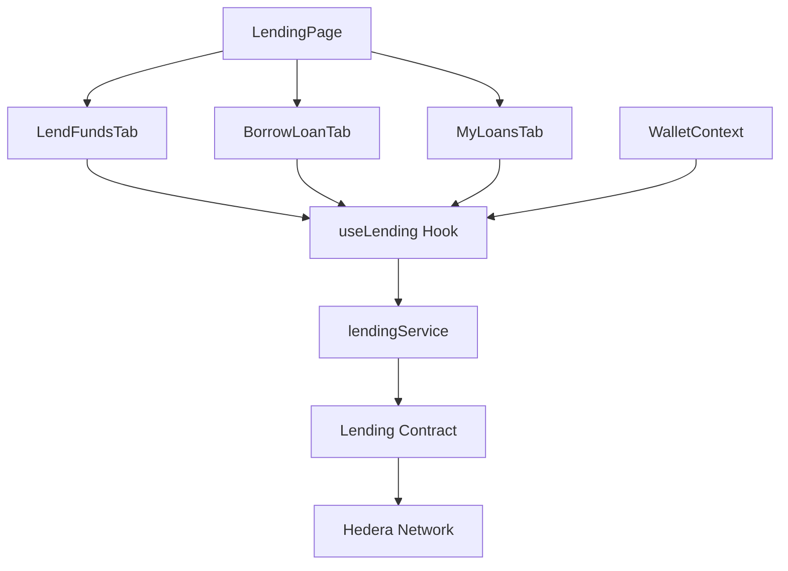
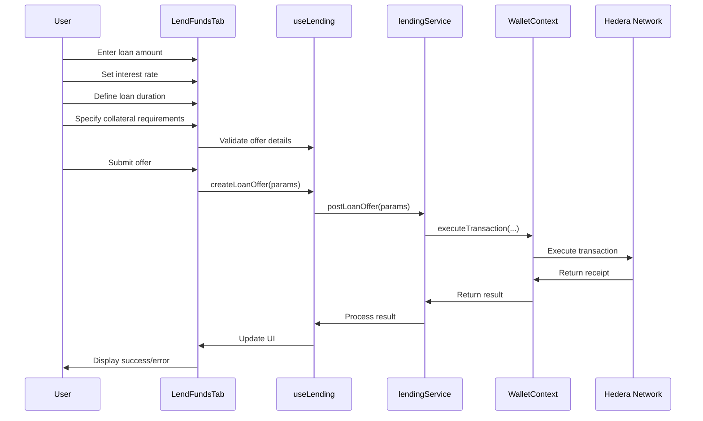
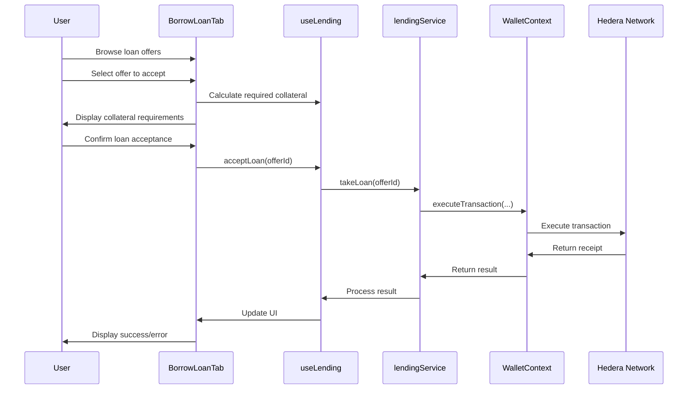

# Lending System

## Overview

The Tajiri lending system enables peer-to-peer lending of HBAR and tokenized assets on the Hedera network. It allows users to create loan offers, request loans with collateral, and manage their lending activities. The system integrates with the `TajiriLending` smart contract to facilitate secure and transparent lending operations.

## Architecture



## Key Components

### 1. LendingPage

Located at `frontend/src/app/lend/page.tsx`, this page component:
- Serves as the main entry point for lending activities
- Provides tabbed navigation between different sections
- Integrates all lending functionality

### 2. LendFundsTab Component

Located at `frontend/src/components/Lending/LendFundsTab.tsx`, this component:
- Allows lenders to create loan offers
- Displays available loan requests
- Provides interface for fulfilling loan requests
- Manages loan offer creation flow

### 3. BorrowLoanTab Component

Located at `frontend/src/components/Lending/BorrowLoanTab.tsx`, this component:
- Enables borrowers to create loan requests
- Shows available lending offers
- Provides interface for accepting loans
- Handles collateral management

### 4. MyLoansTab Component

Located at `frontend/src/components/Lending/MyLoansTab.tsx`, this component:
- Displays user's active loans (both as lender and borrower)
- Shows loan history and repayment status
- Provides repayment functionality
- Handles loan liquidation and collateral claiming

### 5. useLending Hook

Located at `frontend/src/hooks/useLending.ts`, this custom hook:
- Provides lending functionality to components
- Manages loan data and loading states
- Interfaces with the lending service layer
- Handles error states and transaction processing

### 6. lendingService

Located at `frontend/src/services/lendingService.ts`, this service:
- Communicates with the `TajiriLending` smart contract
- Provides methods for creating, fetching, and managing loans
- Handles loan calculations and status tracking
- Manages transaction execution for lending operations

## Lending Flows

### Creating a Loan Offer



### Taking a Loan



## Implementation Details

### Loan Data Structures

```typescript
interface LoanOffer {
  id: string;                // Unique offer ID
  lender: string;            // Address of lender
  principalAmount: number;   // Loan amount in HBAR
  interestRate: number;      // Annual interest rate (e.g., 5.0 for 5%)
  durationDays: number;      // Loan duration in days
  collateralRatio: number;   // Required collateral ratio (e.g., 150 for 150%)
  collateralTokenId: string; // Token accepted as collateral
  status: LoanStatus;        // Status of the loan offer
  timestamp: number;         // Creation timestamp
}

interface ActiveLoan {
  id: string;                // Unique loan ID
  lender: string;            // Address of lender
  borrower: string;          // Address of borrower
  principalAmount: number;   // Loan amount in HBAR
  interestRate: number;      // Annual interest rate
  durationDays: number;      // Loan duration in days
  startTimestamp: number;    // When the loan started
  dueTimestamp: number;      // When the loan is due
  collateralTokenId: string; // Token used as collateral
  collateralAmount: number;  // Amount of collateral token
  repaidAmount: number;      // Amount repaid so far
  status: LoanStatus;        // Current loan status
}

enum LoanStatus {
  ACTIVE = "ACTIVE",
  COMPLETED = "COMPLETED",
  DEFAULTED = "DEFAULTED",
  LIQUIDATED = "LIQUIDATED",
  CANCELLED = "CANCELLED"
}
```

### Key Methods

#### Creating a Loan Offer

```typescript
async function createLoanOffer(
  principalAmount: number,
  interestRate: number,
  durationDays: number,
  collateralRatio: number,
  collateralTokenId: string
): Promise<boolean> {
  if (!wallet.isConnected || !wallet.smartWalletId) {
    throw new Error("Wallet not connected");
  }
  
  setLoading(true);
  
  try {
    // Convert principal amount to tiny bars
    const principalTinyBars = Math.floor(principalAmount * 100000000);
    
    // Format interest rate (e.g., 5.5% -> 550)
    const interestRateFormatted = Math.floor(interestRate * 100);
    
    // Format collateral ratio (e.g., 150% -> 15000)
    const collateralRatioFormatted = Math.floor(collateralRatio * 100);
    
    // Execute the transaction through the wallet
    await wallet.executeTransaction(
      LENDING_CONTRACT_ID,
      "createLoanOffer",
      [
        principalTinyBars.toString(),
        interestRateFormatted.toString(),
        durationDays.toString(),
        collateralRatioFormatted.toString(),
        collateralTokenId
      ],
      principalAmount // Fund the loan with the principal amount
    );
    
    // Refresh offers
    await refreshLoanOffers();
    
    return true;
  } catch (error) {
    console.error("Error creating loan offer:", error);
    setError(`Failed to create loan offer: ${error.message}`);
    return false;
  } finally {
    setLoading(false);
  }
}
```

#### Accepting a Loan

```typescript
async function acceptLoan(
  offerId: string,
  collateralAmount: number
): Promise<boolean> {
  if (!wallet.isConnected || !wallet.smartWalletId) {
    throw new Error("Wallet not connected");
  }
  
  setLoading(true);
  
  try {
    // Get loan offer details
    const offer = await getLoanOfferDetails(offerId);
    
    // Convert collateral amount to the token's format
    const tokenDecimals = await getTokenDecimals(offer.collateralTokenId);
    const adjustedCollateralAmount = Math.floor(collateralAmount * Math.pow(10, tokenDecimals));
    
    // Check if token is associated
    const isAssociated = await wallet.isTokenAssociated(offer.collateralTokenId);
    
    if (!isAssociated) {
      // Associate token first
      await wallet.associateToken(offer.collateralTokenId);
    }
    
    // Execute the transaction through the wallet
    await wallet.executeTransaction(
      LENDING_CONTRACT_ID,
      "acceptLoan",
      [offerId, adjustedCollateralAmount.toString()],
      0 // No HBAR needed, collateral is in tokens
    );
    
    // Refresh loans
    await refreshActiveLoans();
    
    return true;
  } catch (error) {
    console.error("Error accepting loan:", error);
    setError(`Failed to accept loan: ${error.message}`);
    return false;
  } finally {
    setLoading(false);
  }
}
```

#### Repaying a Loan

```typescript
async function repayLoan(
  loanId: string,
  repaymentAmount: number
): Promise<boolean> {
  if (!wallet.isConnected || !wallet.smartWalletId) {
    throw new Error("Wallet not connected");
  }
  
  setLoading(true);
  
  try {
    // Convert HBAR amount to tiny bars
    const repaymentTinyBars = Math.floor(repaymentAmount * 100000000);
    
    // Execute the transaction through the wallet
    await wallet.executeTransaction(
      LENDING_CONTRACT_ID,
      "repayLoan",
      [loanId, repaymentTinyBars.toString()],
      repaymentAmount // Send HBAR with the transaction
    );
    
    // Refresh loans
    await refreshActiveLoans();
    
    return true;
  } catch (error) {
    console.error("Error repaying loan:", error);
    setError(`Failed to repay loan: ${error.message}`);
    return false;
  } finally {
    setLoading(false);
  }
}
```

## UI Components

### LendingPage Component

The LendingPage component provides a comprehensive interface for:
- Navigating between lending, borrowing, and active loans
- Educational information about P2P lending
- Platform statistics and user summaries

Key features:
- Tabbed navigation
- Educational sections
- Statistics dashboard
- User activity summary

### LendFundsTab Component

This component provides an interface for:
- Creating new loan offers with configurable terms
- Browsing and filtering loan requests
- Managing lending portfolio
- Tracking returns on lending

Key features:
- Loan term configuration (amount, interest, duration)
- Collateral requirements setting
- Risk assessment indicators
- Expected return calculator

### BorrowLoanTab Component

This component enables users to:
- Browse available lending offers
- Filter offers by amount, duration, and interest rate
- Create loan requests
- Manage collateral for loans

Key features:
- Loan offer comparison
- Collateral calculator
- Repayment schedule preview
- Interest cost calculator

### MyLoansTab Component

This component displays:
- Active loans where user is a lender
- Active loans where user is a borrower
- Loan repayment interface
- Collateral management

Key features:
- Loan status tracking
- Repayment scheduling
- Collateral monitoring
- Liquidation protection alerts

## Calculations and Formulas

### Interest Calculation

```typescript
function calculateTotalInterest(
  principalAmount: number,
  interestRate: number,
  durationDays: number
): number {
  // Convert annual interest rate to daily rate
  const dailyRate = interestRate / 36500; // 365 days * 100 (for percentage)
  
  // Calculate total interest
  const interest = principalAmount * dailyRate * durationDays;
  
  // Round to 8 decimal places
  return Math.floor(interest * 100000000) / 100000000;
}
```

### Collateral Calculation

```typescript
function calculateRequiredCollateral(
  principalAmount: number,
  collateralRatio: number,
  collateralTokenPrice: number
): number {
  // Convert percentage to decimal (e.g., 150% -> 1.5)
  const ratioDecimal = collateralRatio / 100;
  
  // Calculate required collateral value in HBAR
  const collateralValueInHBAR = principalAmount * ratioDecimal;
  
  // Convert to collateral token amount
  const collateralAmount = collateralValueInHBAR / collateralTokenPrice;
  
  // Round to 8 decimal places
  return Math.ceil(collateralAmount * 100000000) / 100000000;
}
```

### Liquidation Threshold

```typescript
function isNearLiquidation(
  loan: ActiveLoan,
  currentCollateralPrice: number
): boolean {
  // Calculate current collateral value
  const collateralValue = loan.collateralAmount * currentCollateralPrice;
  
  // Calculate outstanding loan value (principal + interest)
  const outstandingValue = loan.principalAmount - loan.repaidAmount + 
                          calculateTotalInterest(
                            loan.principalAmount,
                            loan.interestRate,
                            loan.durationDays
                          );
  
  // Calculate current collateral ratio
  const currentRatio = (collateralValue / outstandingValue) * 100;
  
  // Check if within 10% of liquidation threshold
  return currentRatio < 110; // Typically liquidation at 100%
}
```

## Integration with Wallet System

The lending system integrates with the wallet system:

### Transaction Execution

All lending operations are executed through the wallet context:

```typescript
// Inside useLending hook
const createLoanRequest = async (
  principalAmount: number,
  interestRate: number,
  durationDays: number,
  collateralTokenId: string,
  collateralAmount: number
) => {
  if (!wallet.isConnected || !wallet.smartWalletId) {
    throw new Error("Wallet not connected");
  }
  
  // Format parameters
  const principalTinyBars = Math.floor(principalAmount * 100000000);
  const interestRateFormatted = Math.floor(interestRate * 100);
  const tokenDecimals = await getTokenDecimals(collateralTokenId);
  const adjustedCollateralAmount = Math.floor(collateralAmount * Math.pow(10, tokenDecimals));
  
  // Execute transaction
  return wallet.executeTransaction(
    LENDING_CONTRACT_ID,
    "createLoanRequest",
    [
      principalTinyBars.toString(),
      interestRateFormatted.toString(),
      durationDays.toString(),
      collateralTokenId,
      adjustedCollateralAmount.toString()
    ],
    0 // No HBAR needed for this transaction
  );
};
```

### Token Management

The lending system interfaces with the wallet's token management:

```typescript
// Inside useLending hook
const checkCollateralTokenBalance = async (
  tokenId: string,
  requiredAmount: number
): Promise<boolean> => {
  if (!wallet.isConnected) {
    return false;
  }
  
  try {
    // Check if token is associated
    const isAssociated = await wallet.isTokenAssociated(tokenId);
    
    if (!isAssociated) {
      return false;
    }
    
    // Get token balance
    const balance = await wallet.getTokenBalance(tokenId);
    const numericBalance = parseFloat(balance);
    
    return !isNaN(numericBalance) && numericBalance >= requiredAmount;
  } catch (error) {
    console.error("Error checking token balance:", error);
    return false;
  }
};
```

## Error Handling

The lending system implements comprehensive error handling:

### Loan Validation

```typescript
function validateLoanOffer(
  principalAmount: number,
  interestRate: number,
  durationDays: number,
  collateralRatio: number,
  walletBalance: number
): string | null {
  if (principalAmount <= 0) {
    return "Please enter a valid loan amount";
  }
  
  if (interestRate <= 0) {
    return "Please enter a valid interest rate";
  }
  
  if (durationDays < 1) {
    return "Loan duration must be at least 1 day";
  }
  
  if (collateralRatio < 100) {
    return "Collateral ratio must be at least 100%";
  }
  
  if (principalAmount > walletBalance) {
    return `Insufficient balance. You have ${walletBalance} HBAR but want to lend ${principalAmount} HBAR`;
  }
  
  // All validations passed
  return null;
}
```

### Transaction Error Handling

```typescript
function handleLendingError(error: any): string {
  if (error.message && error.message.includes("INSUFFICIENT_BALANCE")) {
    return "You don't have enough balance to complete this transaction";
  }
  
  if (error.message && error.message.includes("CONTRACT_REVERT_EXECUTED")) {
    if (error.message.includes("Loan offer not found")) {
      return "This loan offer no longer exists";
    }
    if (error.message.includes("Insufficient collateral")) {
      return "The provided collateral does not meet the minimum requirements";
    }
    if (error.message.includes("Loan already taken")) {
      return "This loan has already been taken by another user";
    }
  }
  
  return `Transaction failed: ${error.message || "Unknown error"}`;
}
```

## Security Considerations

### Collateral Security

- Collateral is held in escrow by the smart contract
- Automatic liquidation if collateral value drops below threshold
- Collateral returned only after full loan repayment
- Over-collateralization to protect against price fluctuations

### Loan Validation

- Input validation for all loan parameters
- Balance checks before creating loan offers
- Token association verification
- Price feed validation for collateral valuation

### User Protection

- Clear disclosure of loan terms
- Repayment calculators and schedules
- Liquidation risk indicators
- Automatic early warning for near-liquidation scenarios

## Configuration

### Contract Addresses

The lending system is configured with the following contract address:

```
NEXT_PUBLIC_LENDING_CONTRACT_ID=0.0.XXXXX
```

### Lending Parameters

The system has configurable parameters:
- Minimum loan amount (0.1 HBAR)
- Maximum loan duration (365 days)
- Minimum collateral ratio (100%)
- Liquidation threshold (100%)
- Supported collateral tokens (HTS tokens)

## Troubleshooting

### Common Issues

1. **Loan Creation Failures**
   - Insufficient HBAR balance
   - Invalid loan parameters
   - Network congestion
   - Contract gas limitations

2. **Loan Acceptance Problems**
   - Insufficient collateral token balance
   - Token not associated with wallet
   - Loan offer no longer available
   - Collateral token price fluctuations

3. **Repayment Issues**
   - Insufficient HBAR for repayment
   - Expired loan period
   - Already liquidated loans
   - Partial repayment calculation errors 