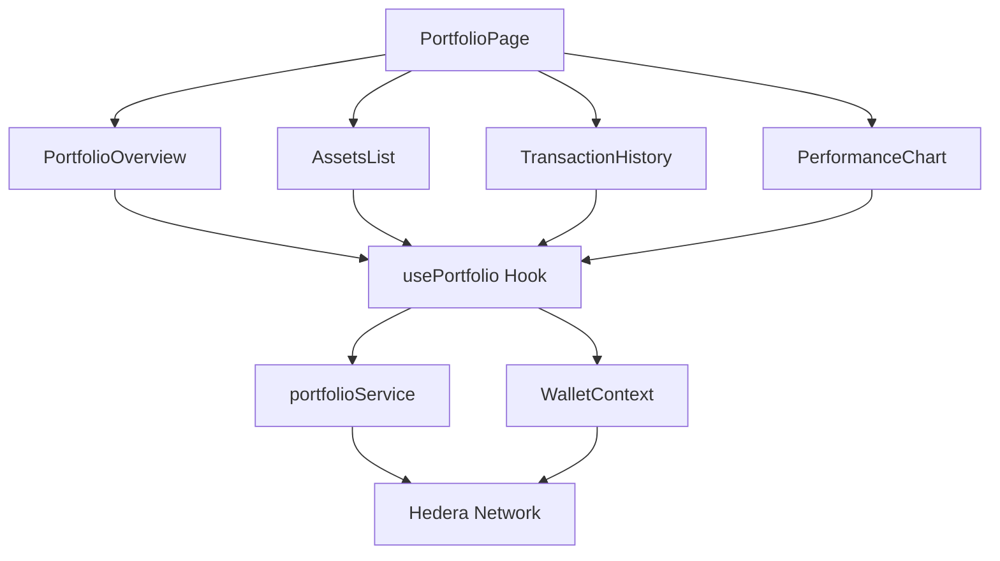
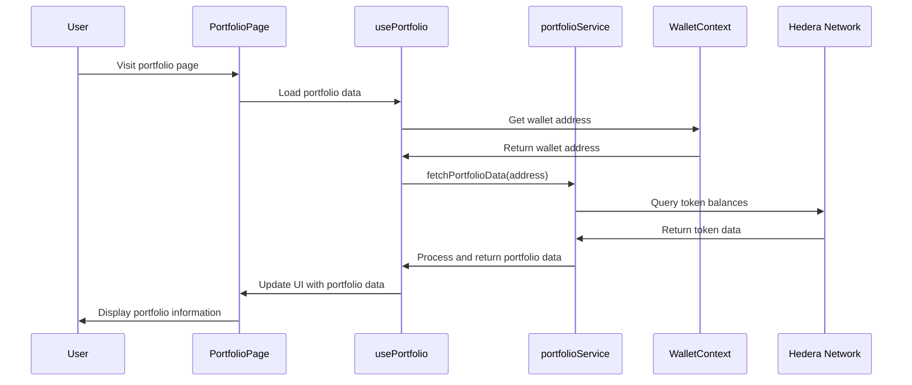

# Portfolio Management System

## Overview

The Tajiri Portfolio Management System provides users with a comprehensive view of their digital assets held within the platform. It displays balances, transaction history, portfolio performance, and asset distribution. The system integrates with the wallet system to fetch real-time data from the Hedera network while providing analytical tools for users to track their investment performance.

## Architecture



## Key Components

### 1. PortfolioPage Component

Located at `frontend/src/app/portfolio/page.tsx`, this component:
- Serves as the main entry point for portfolio management
- Organizes the layout for different portfolio sections
- Handles responsive layout for different screen sizes
- Manages navigation between portfolio subsections

### 2. PortfolioOverview Component

Located at `frontend/src/components/Portfolio/PortfolioOverview.tsx`, this component:
- Displays total portfolio value
- Shows portfolio value change over time (24h, 7d, 30d)
- Provides a breakdown of asset distribution
- Includes key portfolio metrics (e.g., number of assets, transaction count)

### 3. AssetsList Component

Located at `frontend/src/components/Portfolio/AssetsList.tsx`, this component:
- Lists all assets held in the user's wallet
- Displays current balance and value for each asset
- Shows performance metrics for individual assets
- Provides sorting and filtering capabilities
- Includes links to asset details and trading interfaces

### 4. TransactionHistory Component

Located at `frontend/src/components/Portfolio/TransactionHistory.tsx`, this component:
- Displays a paginated list of recent transactions
- Provides filtering by transaction type and date
- Shows transaction details (timestamp, type, amount, status)
- Enables exporting transaction history for record-keeping

### 5. PerformanceChart Component

Located at `frontend/src/components/Portfolio/PerformanceChart.tsx`, this component:
- Renders interactive charts for portfolio performance
- Supports different time periods (24h, 7d, 30d, YTD, 1y, All)
- Compares performance against market benchmarks
- Visualizes asset allocation and distribution

### 6. usePortfolio Hook

Located at `frontend/src/hooks/usePortfolio.ts`, this custom hook:
- Provides portfolio data to components
- Manages data fetching and caching
- Handles loading states and error conditions
- Processes raw blockchain data into usable portfolio metrics

### 7. portfolioService

Located at `frontend/src/services/portfolioService.ts`, this service:
- Fetches portfolio data from the blockchain
- Calculates portfolio metrics and performance statistics
- Formats transaction data for display
- Integrates with external price feeds for valuation

## Portfolio Data Flow

### Initial Data Loading



### Refreshing Portfolio Data

```mermaid
sequenceDiagram
    participant User
    participant UI as PortfolioPage
    participant Hook as usePortfolio
    participant Service as portfolioService
    participant Wallet as WalletContext
    participant Blockchain as Hedera Network

    User->>UI: Click refresh button
    UI->>Hook: refreshPortfolio()
    Hook->>Service: fetchPortfolioData(address, true)
    Service->>Blockchain: Query token balances
    Service->>External as PriceService
    External->>Service: Return current prices
    Blockchain->>Service: Return token data
    Service->>Hook: Process and return updated data
    Hook->>UI: Update UI with refreshed data
    UI->>User: Display updated portfolio
```

## Implementation Details

### Portfolio Data Structure

```typescript
interface PortfolioData {
  totalValue: number;              // Total portfolio value in USD
  totalValueChange24h: number;     // 24-hour change in value
  percentChange24h: number;        // 24-hour percentage change
  assets: Asset[];                 // List of assets in portfolio
  transactions: Transaction[];     // Recent transactions
  performanceData: PerformanceData; // Performance metrics
}

interface Asset {
  tokenId: string;                 // Hedera token ID
  symbol: string;                  // Token symbol
  name: string;                    // Token name
  balance: string;                 // Token balance
  decimals: number;                // Token decimals
  valueUsd: number;                // Current USD value
  percentChange24h: number;        // 24-hour percentage change
  percentOfPortfolio: number;      // Percentage of total portfolio
}

interface Transaction {
  id: string;                      // Transaction ID
  timestamp: number;               // Transaction timestamp
  type: TransactionType;           // Type of transaction
  tokenId: string;                 // Involved token ID
  amount: string;                  // Transaction amount
  status: TransactionStatus;       // Transaction status
  fromAddress?: string;            // Sender address (if applicable)
  toAddress?: string;              // Recipient address (if applicable)
}

interface PerformanceData {
  timestamps: number[];            // Array of timestamp points
  values: number[];                // Array of portfolio values
  timeframe: Timeframe;            // Current timeframe
}

enum TransactionType {
  RECEIVE = "RECEIVE",
  SEND = "SEND",
  MINT = "MINT",
  REDEEM = "REDEEM",
  TRADE = "TRADE",
  STAKE = "STAKE",
  UNSTAKE = "UNSTAKE",
  CLAIM = "CLAIM"
}

enum TransactionStatus {
  SUCCESS = "SUCCESS",
  PENDING = "PENDING",
  FAILED = "FAILED"
}

enum Timeframe {
  DAY = "24h",
  WEEK = "7d",
  MONTH = "30d",
  YEAR_TO_DATE = "YTD",
  YEAR = "1y",
  ALL = "All"
}
```

### Key Methods

#### Fetching Portfolio Data

```typescript
async function fetchPortfolioData(
  walletAddress: string,
  forceRefresh: boolean = false
): Promise<PortfolioData> {
  if (!walletAddress) {
    throw new Error("Wallet address is required");
  }
  
  // Check cache if not forcing refresh
  if (!forceRefresh && portfolioCache.has(walletAddress)) {
    const cachedData = portfolioCache.get(walletAddress);
    if (Date.now() - cachedData.timestamp < CACHE_DURATION) {
      return cachedData.data;
    }
  }
  
  try {
    // Fetch token balances
    const tokenBalances = await fetchTokenBalances(walletAddress);
    
    // Fetch token metadata
    const tokensWithMetadata = await Promise.all(
      tokenBalances.map(async (token) => {
        const metadata = await fetchTokenMetadata(token.tokenId);
        return { ...token, ...metadata };
      })
    );
    
    // Fetch current prices
    const tokensWithPrices = await addPriceData(tokensWithMetadata);
    
    // Calculate total value
    const totalValue = tokensWithPrices.reduce(
      (sum, token) => sum + token.valueUsd,
      0
    );
    
    // Fetch recent transactions
    const transactions = await fetchRecentTransactions(walletAddress);
    
    // Fetch historical performance data
    const performanceData = await fetchPerformanceData(
      walletAddress,
      Timeframe.MONTH
    );
    
    // Calculate 24h change
    const previousDayValue = performanceData.values[performanceData.values.length - 2] || totalValue;
    const totalValueChange24h = totalValue - previousDayValue;
    const percentChange24h = previousDayValue > 0 
      ? (totalValueChange24h / previousDayValue) * 100 
      : 0;
    
    // Calculate percentage of portfolio for each asset
    const assetsWithPercentage = tokensWithPrices.map(token => ({
      ...token,
      percentOfPortfolio: totalValue > 0 ? (token.valueUsd / totalValue) * 100 : 0
    }));
    
    const portfolioData = {
      totalValue,
      totalValueChange24h,
      percentChange24h,
      assets: assetsWithPercentage,
      transactions,
      performanceData
    };
    
    // Update cache
    portfolioCache.set(walletAddress, {
      timestamp: Date.now(),
      data: portfolioData
    });
    
    return portfolioData;
  } catch (error) {
    console.error("Error fetching portfolio data:", error);
    throw new Error(`Failed to fetch portfolio data: ${error.message}`);
  }
}
```

#### Calculating Asset Distribution

```typescript
function calculateAssetDistribution(
  assets: Asset[]
): { label: string; value: number; color: string }[] {
  // Sort assets by value
  const sortedAssets = [...assets].sort((a, b) => b.valueUsd - a.valueUsd);
  
  // Take top 5 assets
  const topAssets = sortedAssets.slice(0, 5);
  
  // If there are more than 5 assets, add an "Others" category
  if (sortedAssets.length > 5) {
    const othersValue = sortedAssets
      .slice(5)
      .reduce((sum, asset) => sum + asset.valueUsd, 0);
    
    topAssets.push({
      tokenId: "others",
      symbol: "Others",
      name: "Others",
      balance: "0",
      decimals: 0,
      valueUsd: othersValue,
      percentChange24h: 0,
      percentOfPortfolio: 0
    });
  }
  
  // Assign colors and format for chart
  return topAssets.map((asset, index) => ({
    label: asset.symbol,
    value: asset.percentOfPortfolio,
    color: CHART_COLORS[index % CHART_COLORS.length]
  }));
}
```

#### Exporting Transaction History

```typescript
async function exportTransactionHistory(
  walletAddress: string,
  format: 'csv' | 'pdf' = 'csv'
): Promise<string> {
  try {
    // Fetch all transactions
    const transactions = await fetchAllTransactions(walletAddress);
    
    if (format === 'csv') {
      // Convert to CSV
      const headers = ['Date', 'Type', 'Token', 'Amount', 'Status', 'Transaction ID'];
      const rows = transactions.map(tx => [
        new Date(tx.timestamp).toISOString(),
        tx.type,
        tx.tokenId,
        tx.amount,
        tx.status,
        tx.id
      ]);
      
      const csvContent = [
        headers.join(','),
        ...rows.map(row => row.join(','))
      ].join('\n');
      
      return csvContent;
    } else {
      // Generate PDF (in real implementation, this would use a PDF library)
      throw new Error('PDF export not implemented');
    }
  } catch (error) {
    console.error("Error exporting transaction history:", error);
    throw new Error(`Failed to export transaction history: ${error.message}`);
  }
}
```

## UI Components

### PortfolioPage Component

The PortfolioPage component provides:
- A responsive layout with main sections
- A header with summary information
- Navigation between portfolio subsections
- Loading states and error handling

Key features:
- Responsive grid layout
- Real-time data refreshing
- Section navigation
- Data export options

### PortfolioOverview Component

This component displays:
- Total portfolio value with 24h change indicator
- Portfolio performance summary
- Asset distribution donut chart
- Quick action buttons for common tasks

Key features:
- Value change indicators with colors
- Interactive asset distribution chart
- Market trend information
- "Add funds" and "Trade" quick actions

### AssetsList Component

This component provides:
- A sortable table of all assets
- Search and filter functionality
- Token icons and metadata
- Performance indicators

Key features:
- Sort by name, balance, value, or performance
- Filter by token type or custom categories
- Color-coded performance indicators
- Links to trading and token detail pages

### TransactionHistory Component

This component displays:
- A chronological list of transactions
- Transaction details on expansion
- Status indicators for each transaction
- Pagination and filtering controls

Key features:
- Infinite scroll pagination
- Date range filtering
- Transaction type filtering
- Export functionality
- Transaction hash links to explorers

### PerformanceChart Component

This component renders:
- An interactive line chart for portfolio performance
- Timeframe selection controls
- Price and percentage toggle
- Comparison benchmark options

Key features:
- Responsive chart visualization
- Time period selectors
- Price/percentage view toggle
- Hover tooltips with detailed information

## Integration with Wallet System

The portfolio system integrates with the wallet system:

### Token Balance Retrieval

```typescript
// Inside usePortfolio hook
const getTokenBalances = async (): Promise<Asset[]> => {
  if (!wallet.isConnected || !wallet.smartWalletId) {
    return [];
  }
  
  try {
    // Get all associated tokens
    const associatedTokens = await wallet.getAssociatedTokens();
    
    // Get balances for each token
    const balancesPromises = associatedTokens.map(async (tokenId) => {
      const balance = await wallet.getTokenBalance(tokenId);
      return { tokenId, balance };
    });
    
    const balances = await Promise.all(balancesPromises);
    
    // Get token metadata and add to balances
    const assetsWithMetadata = await Promise.all(
      balances.map(async ({ tokenId, balance }) => {
        const metadata = await portfolioService.getTokenMetadata(tokenId);
        return {
          tokenId,
          balance,
          symbol: metadata.symbol,
          name: metadata.name,
          decimals: metadata.decimals,
          valueUsd: 0,  // Will be populated later
          percentChange24h: 0,  // Will be populated later
          percentOfPortfolio: 0  // Will be calculated later
        };
      })
    );
    
    return assetsWithMetadata;
  } catch (error) {
    console.error("Error fetching token balances:", error);
    setError(`Failed to fetch token balances: ${error.message}`);
    return [];
  }
};
```

### Transaction History Integration

```typescript
// Inside usePortfolio hook
const getTransactionHistory = async (
  limit: number = 10,
  offset: number = 0
): Promise<Transaction[]> => {
  if (!wallet.isConnected || !wallet.smartWalletId) {
    return [];
  }
  
  try {
    // Get transaction history from wallet context
    const mirrorNodeTransactions = await wallet.getTransactionHistory(limit, offset);
    
    // Map mirror node transactions to our Transaction type
    const transactions = mirrorNodeTransactions.map(tx => ({
      id: tx.transactionId,
      timestamp: new Date(tx.consensusTimestamp).getTime(),
      type: mapTransactionType(tx),
      tokenId: tx.tokenId || 'HBAR',
      amount: tx.amount || '0',
      status: tx.status === 'SUCCESS' ? TransactionStatus.SUCCESS : 
              tx.status === 'PENDING' ? TransactionStatus.PENDING : 
              TransactionStatus.FAILED,
      fromAddress: tx.from,
      toAddress: tx.to
    }));
    
    return transactions;
  } catch (error) {
    console.error("Error fetching transaction history:", error);
    setError(`Failed to fetch transaction history: ${error.message}`);
    return [];
  }
};

// Helper function to map transaction types
function mapTransactionType(tx: any): TransactionType {
  if (tx.type === 'CRYPTOCREATE') return TransactionType.MINT;
  if (tx.type === 'CRYPTOTRANSFER') {
    if (tx.from === wallet.smartWalletId) return TransactionType.SEND;
    if (tx.to === wallet.smartWalletId) return TransactionType.RECEIVE;
  }
  if (tx.type === 'TOKENBURN') return TransactionType.REDEEM;
  if (tx.type === 'TOKENREDEEM') return TransactionType.REDEEM;
  if (tx.type === 'TOKENMINT') return TransactionType.MINT;
  // Add more mappings as needed
  
  return TransactionType.TRADE; // Default to TRADE for unknown types
}
```

## Price Calculation

### Token Price Integration

```typescript
// Inside portfolioService
async function getTokenPrices(
  tokenIds: string[]
): Promise<Record<string, TokenPrice>> {
  try {
    // Call price feed API
    const response = await axios.get(`${API_BASE_URL}/prices`, {
      params: { tokens: tokenIds.join(',') }
    });
    
    // Map the response to our format
    const priceMap: Record<string, TokenPrice> = {};
    
    for (const item of response.data) {
      priceMap[item.tokenId] = {
        currentPrice: item.price,
        priceChange24h: item.priceChange24h,
        percentChange24h: item.percentChange24h
      };
    }
    
    return priceMap;
  } catch (error) {
    console.error("Error fetching token prices:", error);
    
    // Return empty prices as fallback
    return tokenIds.reduce((acc, tokenId) => {
      acc[tokenId] = {
        currentPrice: 0,
        priceChange24h: 0,
        percentChange24h: 0
      };
      return acc;
    }, {} as Record<string, TokenPrice>);
  }
}

// Apply prices to assets
async function addPriceData(assets: Asset[]): Promise<Asset[]> {
  if (assets.length === 0) return [];
  
  // Get token IDs
  const tokenIds = assets.map(asset => asset.tokenId);
  
  // Fetch prices
  const prices = await getTokenPrices(tokenIds);
  
  // Apply prices to assets
  return assets.map(asset => {
    const price = prices[asset.tokenId] || {
      currentPrice: 0,
      priceChange24h: 0,
      percentChange24h: 0
    };
    
    // Calculate value based on balance and price
    const balanceNumber = parseFloat(asset.balance) / Math.pow(10, asset.decimals);
    const valueUsd = balanceNumber * price.currentPrice;
    
    return {
      ...asset,
      valueUsd,
      percentChange24h: price.percentChange24h
    };
  });
}
```

## Error Handling

The portfolio system implements comprehensive error handling:

### Data Fetching Error Handling

```typescript
// Inside usePortfolio hook
const fetchPortfolioData = async (forceRefresh = false) => {
  if (!wallet.isConnected) {
    setError("Wallet not connected");
    return;
  }
  
  setLoading(true);
  setError(null);
  
  try {
    // Get wallet address
    const address = wallet.smartWalletId;
    
    if (!address) {
      throw new Error("Wallet address not available");
    }
    
    // Fetch portfolio data
    const data = await portfolioService.fetchPortfolioData(
      address,
      forceRefresh
    );
    
    setPortfolioData(data);
  } catch (error) {
    console.error("Error fetching portfolio data:", error);
    setError(`Failed to load portfolio: ${error.message}`);
    
    // Set empty portfolio data as fallback
    setPortfolioData({
      totalValue: 0,
      totalValueChange24h: 0,
      percentChange24h: 0,
      assets: [],
      transactions: [],
      performanceData: {
        timestamps: [],
        values: [],
        timeframe: Timeframe.MONTH
      }
    });
  } finally {
    setLoading(false);
  }
};
```

### UI Error States

The UI components handle error states gracefully:

- Empty state components for no assets
- Error message displays with retry options
- Fallback UI for missing data
- Loading skeletons during data fetching

## Security Considerations

### Data Privacy

- Portfolio data is fetched directly from the blockchain
- No sensitive information is stored on centralized servers
- Cached data is stored only in-memory or in secure browser storage
- Export functionality includes only user's own data

### Data Integrity

- All portfolio data comes directly from the Hedera network
- Price data is obtained from trusted external sources
- Historical data is preserved for accuracy
- Real-time updates ensure data freshness

## Configuration

### Environment Variables

```
NEXT_PUBLIC_PRICE_FEED_API_URL=https://api.example.com/price-feed
NEXT_PUBLIC_PORTFOLIO_CACHE_DURATION=300000
```

### Cache Configuration

The system uses a configurable caching strategy:

```typescript
// Cache configuration
const CACHE_DURATION = parseInt(
  process.env.NEXT_PUBLIC_PORTFOLIO_CACHE_DURATION || '300000'
); // Default 5 minutes

// Cache structure
interface CacheEntry<T> {
  timestamp: number;
  data: T;
}

// Portfolio data cache
const portfolioCache = new Map<string, CacheEntry<PortfolioData>>();
```

## Troubleshooting

### Common Issues

1. **Missing Token Values**
   - Price feed API may be unavailable
   - Token may not have market data available
   - Token decimals may be incorrectly configured

2. **Transaction History Incomplete**
   - Mirror node may be experiencing delays
   - Old transactions may require pagination
   - Custom contract interactions may not be correctly labeled

3. **Performance Chart Issues**
   - Historical price data may be incomplete
   - Time zone differences may affect data points
   - Chart rendering may be affected by window size

### Debugging Steps

1. **Check Wallet Connection**
   - Verify wallet is connected and addresses are available
   - Ensure token associations are correct
   - Check for network connectivity issues

2. **Validate Token Data**
   - Verify token IDs are correct
   - Check token metadata in Hedera explorer
   - Confirm token balances directly from mirror node

3. **Monitor Network Requests**
   - Check API responses for errors
   - Verify data formatting is consistent
   - Monitor for rate limiting or timeout issues

4. **Performance Optimization**
   - Ensure caching is properly configured
   - Reduce unnecessary re-renders
   - Implement virtualization for large asset lists 