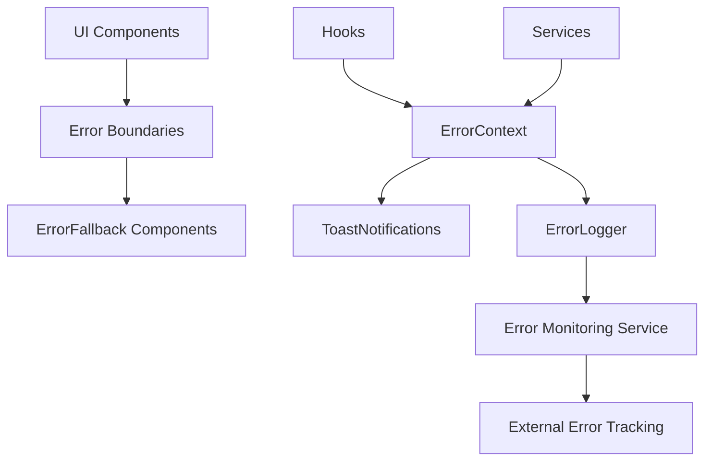
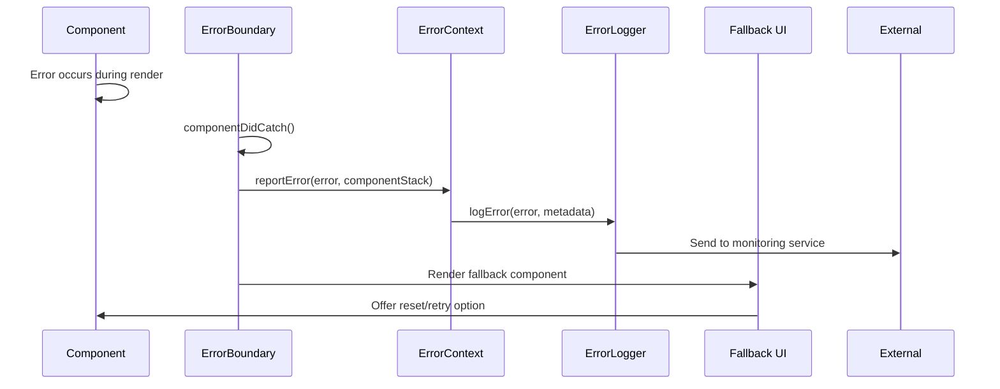
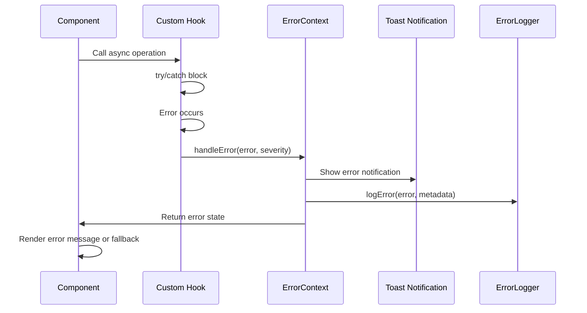

# Error Handling System

## Overview

The Tajiri error handling system provides a robust framework for capturing, logging, reporting, and recovering from errors across the application. The system ensures that users receive meaningful feedback when issues occur while providing developers with detailed information for troubleshooting. The error handling strategy covers user interface errors, network issues, transaction failures, and unexpected application states.

## Architecture



## Key Components

### 1. ErrorContext

Located at `frontend/src/contexts/ErrorContext.tsx`, this context provider:
- Maintains global error state
- Provides error notification functions
- Implements error logging services
- Defines error severity levels
- Manages toast notifications

### 2. Error Boundaries

Located at `frontend/src/components/ErrorBoundary.tsx`, this component:
- Catches JavaScript errors in component tree
- Prevents entire UI from crashing
- Renders fallback UIs for failed components
- Provides reset functionality to recover from errors
- Logs caught errors to monitoring service

### 3. ErrorFallback Components

A collection of components located in `frontend/src/components/errors/` directory:
- `GeneralErrorFallback.tsx`: Default fallback for most errors
- `NetworkErrorFallback.tsx`: Specialized fallback for network issues
- `TransactionErrorFallback.tsx`: Fallback for blockchain transaction errors
- `ContractErrorFallback.tsx`: Fallback for smart contract interaction errors

### 4. useError Hook

Located at `frontend/src/hooks/useError.ts`, this custom hook:
- Provides error handling functions to components
- Formats error messages for different error types
- Categorizes errors by severity
- Provides error recovery functions
- Integrates with ErrorContext

### 5. ToastNotifications

Located at `frontend/src/components/ui/Toast.tsx`, this component:
- Displays non-blocking error notifications
- Provides different styles based on error severity
- Includes auto-dismiss functionality for low-severity errors
- Offers action buttons for error resolution
- Ensures accessibility for error messages

### 6. ErrorLogger

Located at `frontend/src/services/errorLogger.ts`, this service:
- Captures detailed error information
- Formats errors for monitoring systems
- Implements retry logic for logging failures
- Filters sensitive information from error logs
- Batches non-critical errors to reduce network traffic

## Error Handling Flow

### Handling UI Component Errors



### Handling Async Operation Errors



## Implementation Details

### Error Types

```typescript
// Error types used across the application
enum ErrorSeverity {
  LOW = "low",       // Non-critical, doesn't impact core functionality
  MEDIUM = "medium", // Affects functionality but with workarounds
  HIGH = "high",     // Prevents feature from functioning
  CRITICAL = "critical" // Affects application stability
}

interface AppError {
  message: string;         // User-friendly message
  code?: string;           // Error code for categorization
  originalError?: any;     // Original error object
  severity: ErrorSeverity; // Error severity
  component?: string;      // Component where error occurred
  timestamp: number;       // When the error occurred
  metadata?: Record<string, any>; // Additional context
  recoverable: boolean;    // Whether recovery is possible
}

// Specialized error types
interface TransactionError extends AppError {
  transactionId?: string;      // Hedera transaction ID
  contractAddress?: string;    // Related contract address
  transactionType: string;     // Type of transaction (mint, transfer, etc.)
  transactionParams?: any;     // Parameters used in the transaction
}

interface NetworkError extends AppError {
  endpoint?: string;           // API endpoint that failed
  requestMethod?: string;      // HTTP method used
  statusCode?: number;         // HTTP status code if available
  responseBody?: string;       // Sanitized response 
}

interface ValidationError extends AppError {
  field?: string;              // Field that failed validation
  value?: string;              // Sanitized invalid value
  constraints?: string[];      // Validation rules that failed
}
```

### ErrorContext Implementation

```typescript
// Simplified implementation of ErrorContext
const ErrorContext = createContext<ErrorContextType | undefined>(undefined);

export function ErrorProvider({ children }: { children: React.ReactNode }) {
  const [errors, setErrors] = useState<AppError[]>([]);
  const toastRef = useRef<any>(null);
  
  // Add a new error to the error store
  const handleError = useCallback((error: Error | string, severity: ErrorSeverity = ErrorSeverity.MEDIUM, metadata?: Record<string, any>) => {
    const appError = formatError(error, severity, metadata);
    
    // Add to error store
    setErrors(prev => [...prev, appError]);
    
    // Log the error
    errorLogger.logError(appError);
    
    // Show toast notification for user feedback
    if (severity !== ErrorSeverity.LOW) {
      showToast(appError);
    }
    
    return appError;
  }, []);
  
  // Clear a specific error from the store
  const clearError = useCallback((errorId: string) => {
    setErrors(prev => prev.filter(e => e.id !== errorId));
  }, []);
  
  // Clear all errors
  const clearAllErrors = useCallback(() => {
    setErrors([]);
  }, []);
  
  // Format raw error into AppError object
  const formatError = (error: Error | string, severity: ErrorSeverity, metadata?: Record<string, any>): AppError => {
    const message = typeof error === 'string' 
      ? error 
      : error.message || 'An unknown error occurred';
    
    return {
      id: uuidv4(),
      message: getUserFriendlyMessage(message),
      originalError: typeof error !== 'string' ? error : undefined,
      severity,
      timestamp: Date.now(),
      metadata,
      recoverable: severity !== ErrorSeverity.CRITICAL,
      component: metadata?.component
    };
  };
  
  // Show toast notification
  const showToast = (error: AppError) => {
    if (toastRef.current) {
      toastRef.current.show({
        title: getErrorTitle(error.severity),
        description: error.message,
        status: getToastType(error.severity),
        duration: error.severity === ErrorSeverity.CRITICAL ? null : 5000,
        isClosable: true,
      });
    }
  };
  
  // Transform technical error messages to user-friendly versions
  const getUserFriendlyMessage = (technicalMessage: string): string => {
    // Map known technical errors to user-friendly messages
    const errorMap: Record<string, string> = {
      'INSUFFICIENT_BALANCE': 'You don\'t have enough funds to complete this transaction.',
      'UNAUTHORIZED': 'Please sign in to continue.',
      'CONTRACT_REVERT_EXECUTED': 'The transaction was rejected by the smart contract.',
      // Add more mappings as needed
    };
    
    // Check if message contains any known technical error
    for (const [technical, friendly] of Object.entries(errorMap)) {
      if (technicalMessage.includes(technical)) {
        return friendly;
      }
    }
    
    // Return a sanitized version of the original message
    return sanitizeErrorMessage(technicalMessage);
  };
  
  // Helper functions for toast notifications
  const getErrorTitle = (severity: ErrorSeverity): string => {
    switch (severity) {
      case ErrorSeverity.LOW: return 'Notice';
      case ErrorSeverity.MEDIUM: return 'Warning';
      case ErrorSeverity.HIGH: return 'Error';
      case ErrorSeverity.CRITICAL: return 'Critical Error';
      default: return 'Error';
    }
  };
  
  const getToastType = (severity: ErrorSeverity): string => {
    switch (severity) {
      case ErrorSeverity.LOW: return 'info';
      case ErrorSeverity.MEDIUM: return 'warning';
      case ErrorSeverity.HIGH: return 'error';
      case ErrorSeverity.CRITICAL: return 'error';
      default: return 'error';
    }
  };
  
  const contextValue = {
    errors,
    handleError,
    clearError,
    clearAllErrors
  };
  
  return (
    <ErrorContext.Provider value={contextValue}>
      {children}
      <ToastContainer ref={toastRef} />
    </ErrorContext.Provider>
  );
}
```

### ErrorBoundary Implementation

```typescript
class ErrorBoundary extends React.Component<ErrorBoundaryProps, ErrorBoundaryState> {
  constructor(props: ErrorBoundaryProps) {
    super(props);
    this.state = { hasError: false, error: null, errorInfo: null };
  }

  static getDerivedStateFromError(error: Error): ErrorBoundaryState {
    // Update state so the next render will show the fallback UI
    return { hasError: true, error };
  }

  componentDidCatch(error: Error, errorInfo: React.ErrorInfo): void {
    // Capture component stack and report to error service
    this.setState({ errorInfo });
    
    // Report to ErrorContext if available
    if (this.props.onError) {
      this.props.onError(error, errorInfo);
    }
    
    // Log to service
    errorLogger.logError({
      message: error.message,
      originalError: error,
      severity: ErrorSeverity.HIGH,
      timestamp: Date.now(),
      metadata: {
        componentStack: errorInfo.componentStack,
        component: getComponentNameFromStack(errorInfo.componentStack)
      },
      recoverable: true
    });
  }

  resetError = (): void => {
    this.setState({ hasError: false, error: null, errorInfo: null });
  }

  render(): React.ReactNode {
    const { fallback: Fallback, children } = this.props;
    const { hasError, error, errorInfo } = this.state;

    if (hasError) {
      // Render fallback UI when an error occurs
      return <Fallback error={error} errorInfo={errorInfo} resetError={this.resetError} />;
    }

    return children;
  }
}
```

### useError Hook Implementation

```typescript
export function useError() {
  const errorContext = useContext(ErrorContext);
  
  if (!errorContext) {
    throw new Error('useError must be used within an ErrorProvider');
  }
  
  const { handleError, clearError, clearAllErrors, errors } = errorContext;
  
  // Handle transaction errors
  const handleTransactionError = useCallback((
    error: any,
    transactionDetails?: {
      transactionId?: string;
      contractAddress?: string;
      transactionType: string;
      transactionParams?: any;
    }
  ) => {
    // Extract error from Hedera response if needed
    const actualError = error.response?.data?.error || error;
    
    // Create transaction error object
    const transactionError: TransactionError = {
      message: actualError.message || 'Transaction failed',
      code: getErrorCodeFromMessage(actualError.message),
      originalError: error,
      severity: ErrorSeverity.HIGH,
      timestamp: Date.now(),
      recoverable: true,
      ...transactionDetails
    };
    
    return handleError(transactionError, ErrorSeverity.HIGH, {
      transactionError: true,
      ...transactionDetails
    });
  }, [handleError]);
  
  // Handle network request errors
  const handleNetworkError = useCallback((
    error: any,
    requestDetails?: {
      endpoint?: string;
      requestMethod?: string;
    }
  ) => {
    const statusCode = error.response?.status;
    let severity: ErrorSeverity = ErrorSeverity.MEDIUM;
    
    // Determine severity based on status code
    if (statusCode === 401 || statusCode === 403) {
      severity = ErrorSeverity.HIGH; // Authentication errors
    } else if (statusCode >= 500) {
      severity = ErrorSeverity.HIGH; // Server errors
    }
    
    // Create network error object
    const networkError: NetworkError = {
      message: getNetworkErrorMessage(error, statusCode),
      code: `HTTP_${statusCode || 'ERROR'}`,
      originalError: error,
      severity,
      timestamp: Date.now(),
      recoverable: true,
      endpoint: requestDetails?.endpoint,
      requestMethod: requestDetails?.requestMethod,
      statusCode,
      responseBody: sanitizeResponseBody(error.response?.data)
    };
    
    return handleError(networkError, severity, {
      networkError: true,
      ...requestDetails,
      statusCode
    });
  }, [handleError]);
  
  // Handle form validation errors
  const handleValidationError = useCallback((
    field: string,
    value: any,
    constraints: string[]
  ) => {
    const validationError: ValidationError = {
      message: `Invalid value for ${field}`,
      severity: ErrorSeverity.LOW,
      timestamp: Date.now(),
      recoverable: true,
      field,
      value: typeof value === 'string' ? value : JSON.stringify(value),
      constraints
    };
    
    return handleError(validationError, ErrorSeverity.LOW, {
      validationError: true,
      field,
      constraints
    });
  }, [handleError]);
  
  // Helper function for network error messages
  const getNetworkErrorMessage = (error: any, statusCode?: number): string => {
    if (error.message === 'Network Error') {
      return 'Unable to connect to the server. Please check your internet connection.';
    }
    
    if (statusCode === 401) {
      return 'Your session has expired. Please sign in again.';
    }
    
    if (statusCode === 403) {
      return 'You don\'t have permission to perform this action.';
    }
    
    if (statusCode === 404) {
      return 'The requested resource was not found.';
    }
    
    if (statusCode === 429) {
      return 'Too many requests. Please try again later.';
    }
    
    if (statusCode && statusCode >= 500) {
      return 'The server encountered an error. Please try again later.';
    }
    
    return error.message || 'An unknown network error occurred';
  };
  
  // Helper to get error code from message
  const getErrorCodeFromMessage = (message: string): string => {
    // Extract error codes from known patterns
    if (message.includes('INSUFFICIENT_BALANCE')) {
      return 'INSUFFICIENT_BALANCE';
    }
    
    if (message.includes('CONTRACT_REVERT_EXECUTED')) {
      return 'CONTRACT_REVERT_EXECUTED';
    }
    
    // More code extraction logic...
    
    return 'UNKNOWN_ERROR';
  };
  
  return {
    handleError,
    handleTransactionError,
    handleNetworkError,
    handleValidationError,
    clearError,
    clearAllErrors,
    errors
  };
}
```

### ErrorLogger Implementation

```typescript
class ErrorLogger {
  private queue: AppError[] = [];
  private isSending: boolean = false;
  private retryCount: Record<string, number> = {};
  private maxRetries: number = 3;
  
  constructor(private readonly endpoint: string) {}
  
  public logError(error: AppError): void {
    // Add error to queue
    this.queue.push(this.prepareError(error));
    
    // Start processing queue if not already in progress
    if (!this.isSending) {
      this.processQueue();
    }
  }
  
  private prepareError(error: AppError): AppError {
    // Create a copy to avoid mutating the original
    const preparedError = { ...error };
    
    // Remove sensitive information
    if (preparedError.metadata) {
      preparedError.metadata = this.sanitizeMetadata(preparedError.metadata);
    }
    
    // Add application version and environment
    preparedError.metadata = {
      ...preparedError.metadata,
      appVersion: process.env.NEXT_PUBLIC_APP_VERSION,
      environment: process.env.NEXT_PUBLIC_ENVIRONMENT
    };
    
    return preparedError;
  }
  
  private sanitizeMetadata(metadata: Record<string, any>): Record<string, any> {
    const sanitized = { ...metadata };
    
    // Remove potential sensitive data
    const sensitiveKeys = ['privateKey', 'password', 'secret', 'token', 'auth'];
    for (const key of Object.keys(sanitized)) {
      if (sensitiveKeys.some(sk => key.toLowerCase().includes(sk))) {
        sanitized[key] = '[REDACTED]';
      }
    }
    
    return sanitized;
  }
  
  private async processQueue(): Promise<void> {
    if (this.queue.length === 0) {
      this.isSending = false;
      return;
    }
    
    this.isSending = true;
    
    // Take batch of errors (up to 10)
    const batch = this.queue.slice(0, 10);
    
    try {
      // Send to monitoring service
      await this.sendToMonitoringService(batch);
      
      // Remove processed errors from queue
      this.queue = this.queue.slice(batch.length);
      
      // Continue processing queue
      this.processQueue();
    } catch (error) {
      // Retry with exponential backoff
      const batchId = new Date().getTime().toString();
      this.retryCount[batchId] = (this.retryCount[batchId] || 0) + 1;
      
      if (this.retryCount[batchId] <= this.maxRetries) {
        const delay = Math.pow(2, this.retryCount[batchId]) * 1000;
        
        setTimeout(() => {
          this.processQueue();
        }, delay);
      } else {
        // Remove batch after max retries
        this.queue = this.queue.slice(batch.length);
        this.processQueue();
        
        // Log to console as last resort
        console.error('Failed to send errors to monitoring service after max retries', batch);
      }
    }
  }
  
  private async sendToMonitoringService(errors: AppError[]): Promise<void> {
    // Skip in development mode unless configured to send
    if (process.env.NODE_ENV === 'development' && 
        process.env.NEXT_PUBLIC_SEND_ERRORS_IN_DEV !== 'true') {
      console.error('Error(s) occurred:', errors);
      return Promise.resolve();
    }
    
    // Send to actual monitoring service in production
    return fetch(this.endpoint, {
      method: 'POST',
      headers: {
        'Content-Type': 'application/json',
        'X-API-Key': process.env.NEXT_PUBLIC_ERROR_LOGGING_API_KEY || ''
      },
      body: JSON.stringify({
        errors,
        timestamp: new Date().toISOString(),
        source: 'frontend'
      })
    }).then(response => {
      if (!response.ok) {
        throw new Error(`Error logging failed with status: ${response.status}`);
      }
    });
  }
}

// Create instance
export const errorLogger = new ErrorLogger(
  process.env.NEXT_PUBLIC_ERROR_LOGGING_ENDPOINT || '/api/log-error'
);

// Export default instance
export default errorLogger;
```

## Contract Error Handling

The application provides specialized handling for smart contract errors:

### Contract Error Mapping

```typescript
// Located in frontend/src/utils/contractErrorMapper.ts

interface ContractErrorMap {
  [key: string]: {
    message: string;
    severity: ErrorSeverity;
    suggestion?: string;
  }
}

const contractErrorMap: ContractErrorMap = {
  // TajiriStock contract errors
  "STOCK_NOT_FOUND": {
    message: "The stock you're looking for does not exist",
    severity: ErrorSeverity.MEDIUM
  },
  "INSUFFICIENT_STOCK_BALANCE": {
    message: "You don't have enough stock balance for this operation",
    severity: ErrorSeverity.MEDIUM,
    suggestion: "Please check your portfolio and try a smaller amount"
  },
  "STOCK_SUPPLY_EXCEEDED": {
    message: "Cannot mint more of this stock - maximum supply reached",
    severity: ErrorSeverity.HIGH
  },
  
  // P2P Trading contract errors
  "OFFER_NOT_FOUND": {
    message: "This trading offer no longer exists",
    severity: ErrorSeverity.MEDIUM,
    suggestion: "The offer may have been fulfilled or cancelled"
  },
  "OFFER_ALREADY_FULFILLED": {
    message: "This trading offer has already been fulfilled",
    severity: ErrorSeverity.MEDIUM,
    suggestion: "Please browse other available offers"
  },
  "CANNOT_FULFILL_OWN_OFFER": {
    message: "You cannot fulfill your own trading offer",
    severity: ErrorSeverity.LOW
  },
  
  // Wallet contract errors
  "UNAUTHORIZED_SIGNER": {
    message: "Unauthorized wallet operation",
    severity: ErrorSeverity.HIGH,
    suggestion: "This operation can only be performed by the wallet owner"
  },
  "TOKEN_NOT_ASSOCIATED": {
    message: "Token not associated with your wallet",
    severity: ErrorSeverity.MEDIUM,
    suggestion: "Please associate this token with your wallet first"
  },
  
  // Fallback for unknown errors
  "UNKNOWN_CONTRACT_ERROR": {
    message: "An unexpected error occurred with the smart contract",
    severity: ErrorSeverity.HIGH,
    suggestion: "Please try again later or contact support"
  }
};

export function mapContractError(errorMessage: string): {
  message: string;
  severity: ErrorSeverity;
  suggestion?: string;
  code: string;
} {
  // Find matching error code in the message
  for (const [code, details] of Object.entries(contractErrorMap)) {
    if (errorMessage.includes(code)) {
      return {
        ...details,
        code
      };
    }
  }
  
  // Default to unknown contract error
  return {
    ...contractErrorMap.UNKNOWN_CONTRACT_ERROR,
    code: "UNKNOWN_CONTRACT_ERROR"
  };
}
```

## Transaction Error Handling

The application provides specialized recovery strategies for transaction errors:

### Transaction Error Recovery

```typescript
// Inside useTransaction hook

// Attempt to recover from common transaction errors
const recoverFromError = async (error: TransactionError): Promise<boolean> => {
  const { code, transactionType } = error;
  
  // Handle token association errors
  if (code === 'TOKEN_NOT_ASSOCIATED' && error.metadata?.tokenId) {
    try {
      // Show confirmation dialog
      const confirmed = await showConfirmDialog(
        'Associate Token',
        `This token needs to be associated with your wallet before you can perform this action. Would you like to associate it now?`
      );
      
      if (!confirmed) {
        return false;
      }
      
      // Associate the token
      await wallet.associateToken(error.metadata.tokenId);
      
      // Retry the original transaction
      await retryTransaction();
      
      return true;
    } catch (associationError) {
      // Handle association error
      handleError(
        associationError, 
        ErrorSeverity.HIGH,
        { recoveryAttempt: true, originalError: error }
      );
      return false;
    }
  }
  
  // Handle insufficient balance errors
  if (code === 'INSUFFICIENT_BALANCE') {
    // Show low balance notification with options to add funds
    showLowBalanceAlert(transactionType);
    return false;
  }
  
  // More recovery strategies...
  
  return false;
};
```

## UI Error Presentation

The application uses several approaches to display errors to users:

### Error States in UI Components

```tsx
// Example of a component with error handling
function StockMintForm() {
  const { handleError, handleTransactionError } = useError();
  const [loading, setLoading] = useState(false);
  const [error, setError] = useState<string | null>(null);
  
  const handleSubmit = async (values: MintFormValues) => {
    setLoading(true);
    setError(null);
    
    try {
      // Validate form input
      if (values.amount <= 0) {
        setError('Amount must be greater than zero');
        return;
      }
      
      // Process the transaction
      await mintStock(values.stockId, values.amount);
      
      // Show success
      toast.success('Stock minted successfully');
    } catch (err) {
      // Handle transaction-specific error
      handleTransactionError(err, {
        transactionType: 'MINT_STOCK',
        transactionParams: values
      });
      
      // Set local error state for form
      setError('Failed to mint stock. Please try again.');
    } finally {
      setLoading(false);
    }
  };
  
  return (
    <form onSubmit={handleSubmit}>
      {/* Form fields */}
      
      {/* Error display */}
      {error && (
        <Alert status="error">
          <AlertIcon />
          <AlertTitle>Error</AlertTitle>
          <AlertDescription>{error}</AlertDescription>
        </Alert>
      )}
      
      <Button type="submit" isLoading={loading}>
        Mint Stock
      </Button>
    </form>
  );
}
```

### Toast Notifications for Transient Errors

The application uses toast notifications for transient errors that don't block the UI:

```typescript
// Inside ErrorContext

// Show toast notification based on error severity
const showErrorToast = (error: AppError) => {
  const { severity, message, code } = error;
  
  // Get contract error details if applicable
  const contractError = code && isContractErrorCode(code) 
    ? mapContractError(code) 
    : null;
  
  // Configure toast based on severity
  const toastConfig = {
    title: getErrorTitle(severity),
    description: contractError?.message || message,
    status: getToastStatus(severity),
    duration: getDuration(severity),
    isClosable: true,
    position: 'bottom-right',
  };
  
  // Add action button for recoverable errors
  if (error.recoverable && contractError?.suggestion) {
    toastConfig.render = (props: any) => (
      <Alert status={toastConfig.status} variant="solid">
        <AlertIcon />
        <Box flex="1">
          <AlertTitle>{toastConfig.title}</AlertTitle>
          <AlertDescription display="block">
            {toastConfig.description}
            <Text fontSize="sm" mt={1}>{contractError.suggestion}</Text>
          </AlertDescription>
        </Box>
        <CloseButton position="absolute" right="8px" top="8px" onClick={props.onClose} />
        {error.recoverable && (
          <Button size="sm" ml={2} onClick={() => recoverFromError(error)}>
            Fix Issue
          </Button>
        )}
      </Alert>
    );
  }
  
  // Show the toast
  toast(toastConfig);
};
```

## Security Considerations

### Error Information Security

- Sensitive information is sanitized before logging
- Error messages are filtered to prevent data leakage
- Stack traces are only included in non-production environments
- Contract error messages are mapped to safe user-friendly messages

### Error Logging Security

- Logging requests use API keys for authentication
- Security-sensitive errors may be sent through separate channels
- Personal data is removed from error logs
- Rate limiting is implemented to prevent abuse

## Configuration

### Environment Variables

```
# Error logging configuration
NEXT_PUBLIC_ERROR_LOGGING_ENDPOINT=https://logging.tajiri.io/api/errors
NEXT_PUBLIC_ERROR_LOGGING_API_KEY=your-api-key
NEXT_PUBLIC_SEND_ERRORS_IN_DEV=false

# Error display configuration
NEXT_PUBLIC_ERROR_SAMPLING_RATE=100
NEXT_PUBLIC_SHOW_VERBOSE_ERRORS=false
```

### Feature Flags

The error system supports feature flags to control behavior:

```typescript
// Error system feature flags
const ERROR_SYSTEM_FLAGS = {
  enableDetailedLogging: process.env.NODE_ENV !== 'production',
  showRecoveryOptions: true,
  logToConsole: process.env.NODE_ENV !== 'production',
  useFallbackUI: true,
  enableErrorSampling: process.env.NODE_ENV === 'production'
};
```

## Troubleshooting

### Common Issues

1. **Silent Failures**
   - Error boundaries may be missing in component tree
   - Catch blocks might swallow errors without handling
   - Async errors might not be properly awaited

2. **Excessive Error Notifications**
   - Multiple components might report the same error
   - Error sampling may need configuration
   - Toast notification duration may be too long

3. **Missing Error Information**
   - Error serialization might lose information
   - Original error objects might not be captured
   - Async context might be lost between operations

### Debugging Tools

The application provides debugging tools for error analysis:

```typescript
// Development-only error inspector
export function ErrorInspector() {
  // Only render in development
  if (process.env.NODE_ENV !== 'development') {
    return null;
  }
  
  const { errors } = useError();
  
  return (
    <div className="error-inspector">
      <h3>Error Inspector ({errors.length})</h3>
      <div className="error-list">
        {errors.map((error) => (
          <div key={error.id} className="error-item">
            <div className="error-header">
              <span className="error-severity">{error.severity}</span>
              <span className="error-code">{error.code || 'NO_CODE'}</span>
              <span className="error-time">
                {new Date(error.timestamp).toLocaleTimeString()}
              </span>
            </div>
            <div className="error-message">{error.message}</div>
            {error.originalError && (
              <pre className="error-details">
                {JSON.stringify(error.originalError, null, 2)}
              </pre>
            )}
          </div>
        ))}
      </div>
    </div>
  );
}
``` 