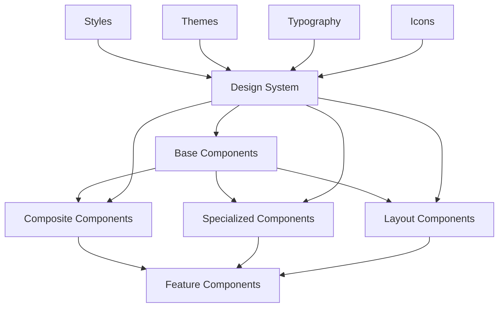

# UI Component System

## Overview

The Tajiri UI Component System provides a comprehensive collection of reusable interface elements that maintain design consistency, improve development efficiency, and ensure a cohesive user experience across the application. The system is built on top of Tailwind CSS and follows a component-based architecture, allowing for flexible composition of complex UI features from simpler building blocks.

## Architecture



## Key Components

### 1. Base Components

Located in `frontend/src/components/ui/` directory, these fundamental UI elements include:

#### Button Component

Located at `frontend/src/components/ui/Button.tsx`, this component:
- Provides various button styles (primary, secondary, outline, ghost)
- Supports different sizes (small, medium, large)
- Includes loading state with spinner
- Implements disabled state styling
- Integrates with keyboard navigation

#### Input Component

Located at `frontend/src/components/ui/Input.tsx`, this component:
- Offers text input with consistent styling
- Includes validation state (error, success)
- Supports prefix and suffix icons
- Implements placeholder and label functionality
- Handles disabled and readonly states

#### Card Component

Located at `frontend/src/components/ui/Card.tsx`, this component:
- Creates a container with shadow and rounded corners
- Includes header, body, and footer sections
- Supports hover effects and color variants
- Provides clickable card option
- Implements responsive padding

#### Other Base Components

- `Alert.tsx`: Notification messages with severity levels
- `Badge.tsx`: Small status indicators
- `Checkbox.tsx`: Selection controls
- `Dropdown.tsx`: Menu selection
- `Modal.tsx`: Dialog overlays
- `Tabs.tsx`: Content organization
- `Toast.tsx`: Temporary notifications

### 2. Composite Components

These components combine multiple base components to create more complex UI elements:

#### FilterBar Component

Located at `frontend/src/components/ui/FilterBar.tsx`, this component:
- Combines search input, dropdown filters, and action buttons
- Manages filter state and selection
- Provides clear filters functionality
- Implements responsive collapse behavior
- Emits filter change events

#### DataTable Component

Located at `frontend/src/components/ui/DataTable.tsx`, this component:
- Renders tabular data with sorting and pagination
- Supports column configuration and customization
- Includes row selection and bulk actions
- Provides empty and loading states
- Implements responsive behavior for mobile

#### FormBuilder Component

Located at `frontend/src/components/ui/FormBuilder.tsx`, this component:
- Creates form layouts from configuration objects
- Manages form state and validation
- Handles field dependencies and conditional logic
- Provides submission and reset functionality
- Supports custom field types

### 3. Specialized Components

These components are designed for specific use cases within the application:

#### CryptoAmount Component

Located at `frontend/src/components/ui/CryptoAmount.tsx`, this component:
- Displays cryptocurrency amounts with appropriate formatting
- Supports different tokens and units
- Provides fiat value conversion
- Includes abbreviated and full formats
- Updates values in real-time

#### Transaction Status Component

Located at `frontend/src/components/ui/TransactionStatus.tsx`, this component:
- Shows the current status of blockchain transactions
- Includes animation for pending states
- Provides visual indicators for success/failure
- Links to transaction explorers
- Displays estimated completion time

#### PriceChart Component

Located at `frontend/src/components/ui/PriceChart.tsx`, this component:
- Renders interactive price charts for assets
- Supports different time periods and granularity
- Implements zoom and pan functionality
- Provides tooltip with detailed information
- Adapts to container size

### 4. Layout Components

These components handle page structure and organization:

#### SidebarLayout Component

Located at `frontend/src/components/layout/SidebarLayout.tsx`, this component:
- Creates a responsive layout with collapsible sidebar
- Manages navigation state and active routes
- Provides header with user menu and notifications
- Implements mobile navigation drawer
- Handles content area with appropriate padding

#### DashboardLayout Component

Located at `frontend/src/components/layout/DashboardLayout.tsx`, this component:
- Extends sidebar layout with dashboard-specific features
- Includes summary cards and quick actions
- Provides section organization with cards
- Implements grid layout for widgets
- Adapts to different screen sizes

#### AuthLayout Component

Located at `frontend/src/components/layout/AuthLayout.tsx`, this component:
- Creates centered layout for authentication screens
- Includes branding and background elements
- Provides card container for form content
- Implements responsive behavior
- Handles success/error states

## Design System Integration

The component system is built on a consistent design system defined in:

### Theme Configuration

Located at `frontend/src/styles/theme.ts`, this configures:
- Color palette with primary, secondary, and accent colors
- Spacing scale for consistent padding and margins
- Typography settings with font families and sizes
- Border radius and shadow definitions
- Breakpoints for responsive design

### Tailwind Configuration

Located at `frontend/tailwind.config.js`, this extends Tailwind with:
- Custom colors from the design system
- Extended typography configuration
- Custom animation definitions
- Plugin integrations
- Responsive variants

## Component Development Guidelines

### Component Structure

Each component follows a consistent structure:

```typescript
// Component definition with TypeScript props interface
interface ButtonProps extends React.ButtonHTMLAttributes<HTMLButtonElement> {
  variant?: 'primary' | 'secondary' | 'outline' | 'ghost';
  size?: 'sm' | 'md' | 'lg';
  isLoading?: boolean;
  leftIcon?: React.ReactNode;
  rightIcon?: React.ReactNode;
  fullWidth?: boolean;
}

// Component implementation with Tailwind classes
export function Button({
  variant = 'primary',
  size = 'md',
  isLoading = false,
  leftIcon,
  rightIcon,
  fullWidth = false,
  className,
  children,
  disabled,
  ...props
}: ButtonProps) {
  // Base classes that apply to all buttons
  const baseClasses = "inline-flex items-center justify-center font-medium rounded-md transition-colors focus:outline-none focus:ring-2 focus:ring-offset-2 focus:ring-primary-500";
  
  // Classes that vary based on variant
  const variantClasses = {
    primary: "bg-primary-600 text-white hover:bg-primary-700 active:bg-primary-800",
    secondary: "bg-secondary-600 text-white hover:bg-secondary-700 active:bg-secondary-800",
    outline: "border border-gray-300 text-gray-700 hover:bg-gray-50 active:bg-gray-100",
    ghost: "text-gray-700 hover:bg-gray-100 active:bg-gray-200"
  };
  
  // Classes that vary based on size
  const sizeClasses = {
    sm: "text-sm py-1.5 px-3",
    md: "text-base py-2 px-4",
    lg: "text-lg py-2.5 px-5"
  };
  
  // Full width class
  const widthClass = fullWidth ? "w-full" : "";
  
  // Disabled state classes
  const disabledClasses = (disabled || isLoading) 
    ? "opacity-50 cursor-not-allowed" 
    : "";
  
  // Combine all classes
  const buttonClasses = [
    baseClasses,
    variantClasses[variant],
    sizeClasses[size],
    widthClass,
    disabledClasses,
    className
  ].join(" ");
  
  return (
    <button
      className={buttonClasses}
      disabled={disabled || isLoading}
      {...props}
    >
      {isLoading && (
        <Spinner size="sm" className="mr-2" />
      )}
      {!isLoading && leftIcon && (
        <span className="mr-2">{leftIcon}</span>
      )}
      {children}
      {rightIcon && (
        <span className="ml-2">{rightIcon}</span>
      )}
    </button>
  );
}
```

### Component Testing

Located in `frontend/src/components/ui/__tests__/` directory, tests ensure:
- Components render correctly with default props
- Different variants and sizes apply appropriate styles
- Interactive states work as expected
- Accessibility requirements are met

Example test for the Button component:

```typescript
import { render, screen, fireEvent } from '@testing-library/react';
import { Button } from '../Button';

describe('Button', () => {
  test('renders correctly with default props', () => {
    render(<Button>Click me</Button>);
    const button = screen.getByRole('button', { name: /click me/i });
    expect(button).toBeInTheDocument();
    expect(button).toHaveClass('bg-primary-600');
  });
  
  test('renders different variants', () => {
    const { rerender } = render(<Button variant="secondary">Secondary</Button>);
    expect(screen.getByRole('button')).toHaveClass('bg-secondary-600');
    
    rerender(<Button variant="outline">Outline</Button>);
    expect(screen.getByRole('button')).toHaveClass('border-gray-300');
    
    rerender(<Button variant="ghost">Ghost</Button>);
    expect(screen.getByRole('button')).toHaveClass('text-gray-700');
  });
  
  test('shows loading state', () => {
    render(<Button isLoading>Loading</Button>);
    expect(screen.getByRole('button')).toBeDisabled();
    expect(screen.getByText('Loading')).toBeInTheDocument();
    expect(screen.getByRole('status')).toBeInTheDocument(); // Spinner
  });
  
  test('calls onClick handler when clicked', () => {
    const handleClick = jest.fn();
    render(<Button onClick={handleClick}>Click me</Button>);
    fireEvent.click(screen.getByRole('button'));
    expect(handleClick).toHaveBeenCalledTimes(1);
  });
});
```

## Component Usage Examples

### Basic Button Usage

```tsx
import { Button } from '@/components/ui/Button';

// Primary button (default)
<Button onClick={handleClick}>
  Click me
</Button>

// Secondary button with loading state
<Button 
  variant="secondary" 
  isLoading={isLoading} 
  onClick={handleSubmit}
>
  Submit
</Button>

// Outline button with icon
<Button 
  variant="outline" 
  leftIcon={<PlusIcon className="w-4 h-4" />}
>
  Add Item
</Button>

// Ghost button that's full width
<Button 
  variant="ghost" 
  fullWidth
  onClick={handleCancel}
>
  Cancel
</Button>
```

### Form Input Usage

```tsx
import { Input } from '@/components/ui/Input';
import { useState } from 'react';

function MyForm() {
  const [value, setValue] = useState('');
  const [error, setError] = useState('');
  
  const handleChange = (e: React.ChangeEvent<HTMLInputElement>) => {
    setValue(e.target.value);
    if (e.target.value.length < 3) {
      setError('Input must be at least 3 characters');
    } else {
      setError('');
    }
  };
  
  return (
    <div className="space-y-4">
      <Input
        label="Username"
        placeholder="Enter your username"
        value={value}
        onChange={handleChange}
        error={error}
        helpText="Choose a unique username for your account"
      />
      
      <Input
        type="password"
        label="Password"
        placeholder="Enter your password"
        required
      />
      
      <Input
        type="number"
        label="Amount"
        placeholder="0.00"
        suffix="HBAR"
        min={0}
      />
    </div>
  );
}
```

### Card Component Example

```tsx
import { Card, CardHeader, CardBody, CardFooter } from '@/components/ui/Card';
import { Button } from '@/components/ui/Button';

function AssetCard({ asset }) {
  return (
    <Card className="hover:shadow-lg transition-shadow">
      <CardHeader className="flex items-center justify-between">
        <div className="flex items-center">
          
          <h3 className="font-semibold text-lg">{asset.name}</h3>
        </div>
        <Badge variant={asset.change > 0 ? "success" : "error"}>
          {asset.change > 0 ? "+" : ""}{asset.change}%
        </Badge>
      </CardHeader>
      
      <CardBody>
        <div className="space-y-2">
          <div className="flex justify-between">
            <span className="text-gray-500">Balance:</span>
            <span>{asset.balance} {asset.symbol}</span>
          </div>
          <div className="flex justify-between">
            <span className="text-gray-500">Value:</span>
            <span>${asset.value.toFixed(2)}</span>
          </div>
          <PriceChart 
            data={asset.priceHistory} 
            height={100} 
            color={asset.change > 0 ? "#10B981" : "#EF4444"}
          />
        </div>
      </CardBody>
      
      <CardFooter className="flex justify-between">
        <Button variant="outline" size="sm">
          Trade
        </Button>
        <Button variant="primary" size="sm">
          Send
        </Button>
      </CardFooter>
    </Card>
  );
}
```

## Layout Component Usage

```tsx
import { SidebarLayout } from '@/components/layout/SidebarLayout';
import { DashboardContent } from '@/components/Dashboard/DashboardContent';

function DashboardPage() {
  return (
    <SidebarLayout>
      <h1 className="text-2xl font-bold mb-6">Dashboard</h1>
      <DashboardContent />
    </SidebarLayout>
  );
}
```

## Responsive Design

Components are designed to be responsive using Tailwind's responsive utilities:

```tsx
<div className="grid grid-cols-1 md:grid-cols-2 lg:grid-cols-3 gap-4">
  {assets.map(asset => (
    <AssetCard key={asset.id} asset={asset} />
  ))}
</div>
```

## Accessibility Features

The component system implements accessibility best practices:

### Keyboard Navigation

```tsx
function KeyboardNavExample() {
  return (
    <div className="flex space-x-2">
      <Button>First</Button>
      <Button>Second</Button>
      <Button>Third</Button>
    </div>
  );
}
```

### ARIA Attributes

```tsx
<Alert 
  status="error" 
  role="alert" 
  aria-live="assertive"
>
  <AlertIcon />
  <AlertTitle>Error</AlertTitle>
  <AlertDescription>
    Unable to complete transaction.
  </AlertDescription>
</Alert>
```

### Focus Management

```tsx
function FocusExample() {
  const initialFocusRef = useRef(null);
  
  return (
    <Modal
      isOpen={isOpen}
      onClose={onClose}
      initialFocusRef={initialFocusRef}
    >
      <ModalHeader>Create Asset</ModalHeader>
      <ModalBody>
        <Input
          ref={initialFocusRef}
          label="Asset Name"
          placeholder="Enter asset name"
        />
        {/* Other fields */}
      </ModalBody>
      <ModalFooter>
        <Button variant="outline" onClick={onClose}>
          Cancel
        </Button>
        <Button ml={3}>
          Create
        </Button>
      </ModalFooter>
    </Modal>
  );
}
```

## Theming

The component system supports theme customization through a theme context:

```typescript
// theme.ts
export const lightTheme = {
  colors: {
    primary: {
      50: '#eef2ff',
      100: '#e0e7ff',
      // ...more shades
      600: '#4f46e5',
      700: '#4338ca',
      800: '#3730a3',
      900: '#312e81',
    },
    // ...other color definitions
  },
  // ...other theme properties
};

export const darkTheme = {
  colors: {
    primary: {
      50: '#f5f3ff',
      // ...different shades for dark mode
      900: '#2e1065',
    },
    // ...other color definitions
  },
  // ...other theme properties
};
```

```tsx
// ThemeProvider.tsx
export function ThemeProvider({ children }) {
  const [theme, setTheme] = useState('light');
  
  const currentTheme = theme === 'light' ? lightTheme : darkTheme;
  
  const toggleTheme = () => {
    setTheme(prev => prev === 'light' ? 'dark' : 'light');
  };
  
  return (
    <ThemeContext.Provider value={{ theme, toggleTheme }}>
      <div className={theme === 'dark' ? 'dark' : ''}>
        {children}
      </div>
    </ThemeContext.Provider>
  );
}
```

Components then access the theme:

```tsx
function ThemedComponent() {
  const { theme, toggleTheme } = useTheme();
  
  return (
    <div className="dark:bg-gray-800 dark:text-white">
      <p>Current theme: {theme}</p>
      <Button onClick={toggleTheme}>
        Toggle Theme
      </Button>
    </div>
  );
}
```

## Icon System

The application uses a unified icon system:

```typescript
// IconLibrary.tsx
import {
  ChartBarIcon,
  CurrencyDollarIcon,
  HomeIcon,
  // ...more icons
} from '@heroicons/react/outline';

export const Icons = {
  Chart: ChartBarIcon,
  Currency: CurrencyDollarIcon,
  Home: HomeIcon,
  // ...more icon mappings
};

// Usage
function IconExample() {
  return (
    <Button
      leftIcon={<Icons.Chart className="w-4 h-4" />}
    >
      View Chart
    </Button>
  );
}
```

## Performance Considerations

### Component Memoization

```tsx
// Memoized component for better performance
const MemoizedDataTable = React.memo(function DataTable({
  data,
  columns,
  onRowClick
}: DataTableProps) {
  // Component implementation
});

// Usage
function TableContainer() {
  // Only re-renders when these dependencies change
  return <MemoizedDataTable data={data} columns={columns} onRowClick={handleRowClick} />;
}
```

### Code Splitting

```typescript
// Lazy-loaded component
const LazyChart = React.lazy(() => import('@/components/ui/Chart'));

function ChartContainer() {
  return (
    <React.Suspense fallback={<Spinner />}>
      <LazyChart data={chartData} />
    </React.Suspense>
  );
}
```

## Troubleshooting

### Common Issues

1. **Styling Inconsistencies**
   - Component may not have correct Tailwind classes
   - Theme context might not be properly set up
   - CSS specificity issues with custom styles

2. **Responsive Behavior Problems**
   - Breakpoint utilities may be missing
   - Container constraints might be needed
   - Overflow issues on small screens

3. **Performance Issues**
   - Components re-rendering too often
   - Missing memoization on expensive components
   - Large component bundles without code splitting

### Debugging Tools

The application includes developer tools to help debug components:

```tsx
// Component Inspector (development only)
function ComponentInspector({ children }) {
  if (process.env.NODE_ENV !== 'development') {
    return <>{children}</>;
  }
  
  return (
    <div className="relative">
      {children}
      <div className="absolute top-0 right-0 bg-yellow-200 px-2 py-1 text-xs rounded-bl-md">
        {children.type?.name || 'Unknown'}
      </div>
    </div>
  );
}
```

## Future Improvements

The component system is continuously evolving with planned enhancements:

1. **Component Storybook**
   - Interactive documentation of all components
   - Visual regression testing
   - Component playground for development

2. **Design Token System**
   - Unified design tokens across all components
   - Better theming support
   - Design system documentation

3. **Animation Library**
   - Standardized transitions and animations
   - Motion components
   - Loading state animations 